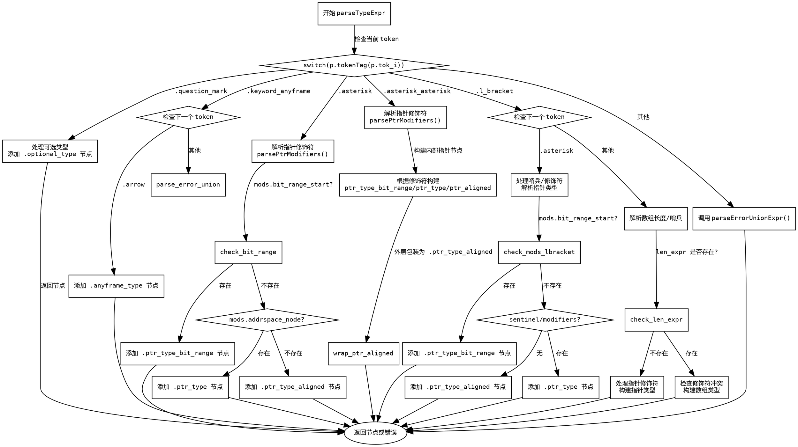

嗯，我现在需要画这个Zig函数的流程图。首先，这个函数是parseTypeExpr，看起来是解析类型表达式的。那我得先理清楚函数的逻辑结构，然后转换成流程图。

首先，函数开始于一个switch语句，根据当前token的标签来决定不同的处理分支。主要的case包括.question_mark、.keyword_anyframe、.asterisk、.asterisk_asterisk、.l_bracket，以及其他情况。每个case里面又有不同的处理逻辑，可能还有嵌套的switch或者条件判断。

比如，第一个case是遇到问号，处理可选类型。然后处理anyframe关键字，后面可能跟箭头或者其他情况。接着是星号和双星号，分别代表不同的指针类型。然后是左括号的情况，里面又分不同的子情况，比如是否有星号、标识符或者冒号，处理数组或指针类型的不同修饰符。最后是其他情况，调用parseErrorUnionExpr。

每个分支中可能还会调用其他函数，如expectTypeExpr、parsePtrModifiers、addNode等，这些可能在流程图中作为处理步骤或子流程。需要注意的是，有些分支内部还有条件判断，比如mods结构中的不同字段是否存在，会影响生成的节点类型。

画流程图的时候，需要从函数入口开始，按照switch的分支展开每个case，然后根据每个case内部的逻辑继续分支。可能需要使用菱形表示条件判断，矩形表示处理步骤，箭头表示流程方向。

另外，代码中有一些递归或嵌套的解析函数调用，比如expectTypeExpr，可能会再次进入parseTypeExpr，但流程图可能不需要详细展开这些，除非特别复杂。不过作为主函数的流程图，可能只需要表示调用这些函数，而不深入其内部。

需要注意的是，像mods.bit_range_start是否存在，或者sentinel是否为空这些条件，都需要在流程图中体现为判断节点。此外，错误处理（如try表达式）可能也需要标记可能的错误路径，但用户可能只需要主要流程。

可能的挑战是处理复杂的嵌套条件，比如在l_bracket的情况下，内部的switch和多个条件判断需要正确分层。可能需要将每个主要分支作为子流程图，或者用多个判断节点来分解。

总结步骤：
1. 确定函数入口，开始。
2. 根据当前token的标签分支出不同的case。
3. 每个case内部处理逻辑，包括可能的子判断。
4. 处理完成后返回相应的节点或错误。
5. 处理所有可能的条件分支，确保覆盖所有路径。

需要确保流程图清晰展示每个判断点和处理步骤，避免遗漏分支。可能需要多次检查代码，确保每个条件都被正确转换为流程图中的节点。
================================================

该流程图使用 Graphviz 的 DOT 语言描述，主要特点如下：

1. **分层结构**：通过 switch-case 和嵌套条件清晰地展示了函数的分支逻辑
2. **关键节点**：
   - 菱形节点表示条件判断
   - 矩形节点表示具体操作
   - 椭圆形表示结束节点
3. **颜色标注**：
   - 黄色背景表示入口/出口
   - 绿色表示主要处理路径
   - 粉色表示嵌套判断

可以通过 Graphviz 工具渲染为 PNG/SVG 等格式，推荐使用在线工具（如 dreampuf.github.io/GraphvizOnline）或本地安装 Graphviz 进行可视化。