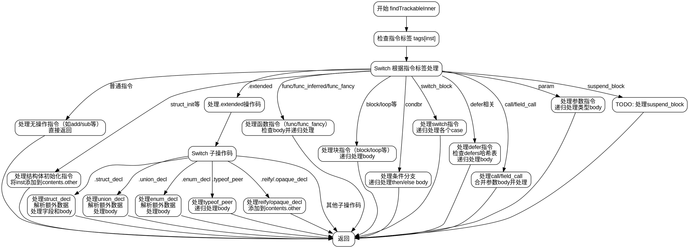

好的，我现在需要为给定的Zig函数`findTrackableInner`绘制一个Graphviz的流程图。首先，我需要理解这个函数的结构和逻辑流程，这样才能准确地转换成流程图。

首先，我会通读代码，了解函数的大致结构。函数接收几个参数，包括Zir实例、分配器、DeclContents指针、defers哈希表和inst索引。函数的主要任务似乎是跟踪某些指令（inst）的类型或声明，并根据不同的指令类型执行不同的处理逻辑。

接下来，函数开始通过switch语句处理不同的指令标签（tags）。每个case对应不同的ZIR指令，如.add、.sub、.declaration等。对于大多数基本指令，函数直接返回，不做任何处理。而对于一些需要跟踪的指令，比如结构体初始化、联合声明、枚举声明等，函数会将它们添加到contents中，并递归处理它们的子体（body）。

特别需要注意的是，对于.extended操作码，函数会进一步处理不同的子操作码，如.struct_decl、.union_decl、.enum_decl等，这些需要更详细的处理步骤，包括解析额外的数据、处理字段、声明等，并递归处理相关的body部分。

此外，函数处理函数定义（.func、.func_inferred、.func_fancy）时，会检查是否有body，如果有，则递归处理返回类型和函数体。对于块结构（如.block、.loop）、条件分支（.condbr）、switch语句等，也会递归处理它们的子体。

在绘制流程图时，我需要将这些逻辑分支可视化。每个主要的switch case应该作为一个决策节点，根据不同的指令类型导向不同的处理流程。递归处理body的部分可能需要表示为子流程或循环结构。

需要注意的是，函数中有多个递归调用，例如在处理struct_decl时，会合并多个body并调用findTrackableBody。这些递归调用应该在流程图中有所体现，可能通过子例程节点或单独的流程框表示。

另外，处理.defer和.defer_err_code时，会使用defers哈希表来避免重复处理相同的指令，这部分逻辑需要通过条件判断节点来表示，检查是否已经存在条目。

由于Graphviz使用节点和边来表示流程，我需要将每个主要的处理步骤作为节点，并用箭头连接它们，表示控制流的转移。对于复杂的结构，如嵌套的switch或循环，可能需要使用子图来组织代码结构，保持流程图的清晰性。

在开始绘制之前，我需要确定各个主要分支，并确保每个分支的处理步骤都被正确表示。例如，处理.extended操作码的部分需要分解为多个子节点，每个子操作码（如.struct_decl、.union_decl等）对应不同的处理路径。

最后，需要检查是否有遗漏的分支或特殊情况，例如.suspend_block目前标记为TODO，可能需要特别注明。同时，确保所有的递归调用和循环都被正确展示，避免流程图过于复杂而难以理解。

总结步骤：
1. 确定函数入口和参数。
2. 处理不同的指令标签，根据switch case创建分支。
3. 对于每个主要指令类型，绘制对应的处理流程。
4. 处理.extended操作码及其子操作码，分解为子流程。
5. 表示递归调用和循环处理body的部分。
6. 处理.defer和.defer_err_code的条件检查。
7. 标注未实现的TODO部分。
8. 确保所有逻辑分支都被覆盖，连接节点形成完整流程图。
================================================
