嗯，我需要为给定的 Zig 函数 `findTrackableInner` 画一个流程图。首先，我得仔细理解这个函数的结构和逻辑。这个函数的作用似乎是遍历 Zig 中间表示（ZIR）的指令，根据不同的指令类型进行不同的处理，比如递归处理函数体、结构体初始化等。

首先，函数开始部分有一些参数，包括 `Zir` 实例、分配器 `gpa`、`DeclContents` 指针、`defers` 哈希表和指令索引 `inst`。然后，使用 `comptime assert` 确保版本正确。接着，获取指令的标签和数据。

接下来是一个大的 `switch` 语句，根据不同的指令标签执行不同的操作。大部分标签直接返回，而有些则需要进一步处理，比如处理结构体、联合体、枚举的声明，或者函数定义等。对于这些复杂的指令，函数会递归调用 `findTrackableBody` 来处理它们的子部分。

我需要将每个 `switch` 的分支转化为流程图的节点和分支。特别是那些需要递归处理的部分，比如处理 `struct_decl`、`union_decl`、`enum_decl` 以及各种函数定义（`func`, `func_inferred`, `func_fancy`），这些都需要在流程图中表示出递归或子流程。

另外，函数中有多个返回点，需要明确每个条件分支的结束点。对于 `switch` 中的 `extended` 操作码，内部还有进一步的 `switch`，需要拆解这些嵌套结构。

可能遇到的困难是如何将复杂的控制流，尤其是嵌套的 `switch` 和递归调用，简化为流程图中的节点和箭头。需要确保每个可能的路径都被覆盖，同时保持图表的清晰性。可能需要将某些复杂部分（如处理结构体声明的详细步骤）抽象为子流程，以避免流程图过于庞大。

最后，需要确保所有可能的错误处理和内存分配操作（如 `try` 语句）在流程图中有所体现，但可能由于流程图主要是控制流，可以适当简化错误处理路径，除非它们显著影响流程。

总结步骤：
1. 确定函数的主要结构，特别是大的 `switch` 语句。
2. 将每个 `case` 转化为流程图的决策节点。
3. 处理递归或子流程调用，将其表示为子流程或单独节点。
4. 处理条件分支（如 `if`、`else`）和循环结构。
5. 确保所有返回点和递归路径都被正确表示。
6. 简化复杂部分，保持流程图的可读性。
================================================

```dot
digraph flowchart {
    node [shape=rectangle, style="rounded", fontname="Arial"];
    edge [fontname="Arial"];

    start [label="开始 findTrackableInner"];
    check_inst_tracking_version [label="comptime assert(Zir.inst_tracking_version == 0)"];
    get_tags_datas [label="获取 tags 和 datas"];
    switch_inst_tag [label="switch (tags[inst])", shape=diamond];

    // 主要分支
    boring_instructions [label="处理无趣指令\n(直接返回)"];
    struct_init_group [label="处理结构体初始化\n添加到 contents.other"];
    extended_opcode [label="处理 extended 操作码", shape=diamond];
    func_handling [label="处理函数指令\n(func/func_inferred/func_fancy)"];
    block_handling [label="处理块指令\n(block/loop/c_import)"];
    condbr_handling [label="处理条件分支\n(condbr/try/switch_block)"];
    defer_handling [label="处理 defer 指令"];
    param_handling [label="处理参数指令"];
    call_handling [label="处理调用指令\n(call/field_call)"];
    return [label="返回"];

    // Extended Opcode 子分支
    extended_boring [label="无趣 extended 指令\n(直接返回)"];
    typeof_peer [label="处理 @TypeOf\n递归处理 body"];
    reify_opaque [label="处理 reify/opaque_decl\n添加到 contents.other"];
    struct_decl [label="处理结构体声明\n递归处理字段和体"];
    union_decl [label="处理联合体声明\n递归处理体"];
    enum_decl [label="处理枚举声明\n递归处理体"];

    // 连接节点
    start -> check_inst_tracking_version;
    check_inst_tracking_version -> get_tags_datas;
    get_tags_datas -> switch_inst_tag;

    switch_inst_tag -> boring_instructions [label="add/sub/mul/..."];
    switch_inst_tag -> struct_init_group [label="struct_init/struct_init_ref"];
    switch_inst_tag -> extended_opcode [label="extended"];
    switch_inst_tag -> func_handling [label="func/func_inferred/func_fancy"];
    switch_inst_tag -> block_handling [label="block/loop/c_import"];
    switch_inst_tag -> condbr_handling [label="condbr/try/switch_block"];
    switch_inst_tag -> defer_handling [label="defer/defer_err_code"];
    switch_inst_tag -> param_handling [label="param/param_comptime"];
    switch_inst_tag -> call_handling [label="call/field_call"];
    switch_inst_tag -> return [label="其他指令"];

    // Extended 分支展开
    extended_opcode -> extended_boring [label="this/ret_addr/..."];
    extended_opcode -> typeof_peer [label="typeof_peer"];
    extended_opcode -> reify_opaque [label="reify/opaque_decl"];
    extended_opcode -> struct_decl [label="struct_decl"];
    extended_opcode -> union_decl [label="union_decl"];
    extended_opcode -> enum_decl [label="enum_decl"];
    extended_boring -> return;
    typeof_peer -> return;
    reify_opaque -> return;
    struct_decl -> return;
    union_decl -> return;
    enum_decl -> return;

    // 函数处理细节
    func_handling -> return [label="处理函数体后返回"];

    // 块处理细节
    block_handling -> return [label="递归处理 block 体后返回"];

    // 条件分支处理
    condbr_handling -> return [label="处理 then/else 分支后返回"];

    // Defer 处理
    defer_handling -> return [label="处理 defer 体后返回"];

    // 参数处理
    param_handling -> return [label="处理参数类型体后返回"];

    // 调用处理
    call_handling -> return [label="处理调用参数后返回"];
}
```
