嗯，用户让我用Graphviz画一个Zig函数的流程图。首先，我需要理解这个函数的结构。函数expr处理不同类型的AST节点，每个case有不同的处理逻辑。比如，有些节点会报错，有些会递归处理子节点。

首先，函数开始于switch语句，根据node的标签进入不同的分支。大部分分支调用addError相关的函数报错，并返回。有些分支处理特定情况，比如数组或结构体的初始化，需要处理子节点。还有像grouped_expression这样的分支会递归调用expr处理子节点。

接下来，我需要确定每个分支的处理流程，以及它们之间的关系。比如，遇到.grouped_expression时，先报错，然后递归处理子节点。而像.number_literal这样的节点则直接调用numberLiteral方法。

需要注意循环和递归的情况，比如处理数组或结构体初始化时，遍历子节点并递归调用expr。同时，有些分支会有条件判断，比如检查子节点类型是否为.number_literal或.identifier。

然后，将这些逻辑转化为流程图。流程图应该从函数入口开始，每个case作为一个判断节点，根据不同的标签进入不同的处理流程。处理完成后，可能返回或继续处理子节点。

需要注意的是，Graphviz使用节点和边来表示流程，每个判断分支对应不同的节点，处理步骤用矩形节点，判断用菱形节点。递归调用需要在流程图中体现，可能通过子流程或连接回现有节点。

可能遇到的挑战是处理大量的case分支，需要合理组织结构，避免图表过于复杂。可以按错误处理、递归处理、特定类型处理等类别分组，简化流程。

最后，确保所有可能的路径都被覆盖，没有遗漏的case，并且流程图的连接正确，没有死循环或未处理的节点。
================================================

```dot
digraph expr_flowchart {
    graph [fontname="Arial", rankdir=TB];
    node [fontname="Arial", shape=rectangle];
    edge [fontname="Arial"];

    start [label="Start expr(zg, node, dest_node)", shape=ellipse];
    switch_node [label="Switch tree.nodeTag(node)", shape=diamond];
    error_operators [label="Call zg.addErrorTok()\n(Operator not allowed)"];
    error_types [label="Call zg.addErrorNode()\n(Types not allowed)"];
    error_control_flow [label="Call zg.addErrorNode()\n(Control flow not allowed)"];
    error_keyword [label="Call zg.addErrorNode()\n('comptime' not allowed)"];
    error_asm [label="Call zg.addErrorNode()\n(Inline ASM not allowed)"];
    error_builtin [label="Call zg.addErrorNode()\n(Builtin calls not allowed)"];
    error_field_access [label="Call zg.addErrorNode()\n(Field access not allowed)"];
    error_slice [label="Call zg.addErrorNode()\n(Slice not allowed)"];
    error_pointers [label="Call zg.addErrorTok()\n(Pointers not allowed)"];
    error_blocks [label="Handle block statements\n(Check if empty)"];
    handle_grouped_expr [label="Report error\nRecursive call expr(child_node)"];
    handle_negation [label="Handle negation\nCheck child node type"];
    handle_number_literal [label="Call zg.numberLiteral()"];
    handle_char_literal [label="Call zg.charLiteral()"];
    handle_identifier [label="Call zg.identifier()"];
    handle_enum_literal [label="Set enum literal node"];
    handle_string_literal [label="Set string literal node"];
    handle_array_init [label="Process array initialization\nRecursive calls on elements"];
    handle_struct_init [label="Process struct initialization\nCheck field names"];
    end [label="Return", shape=ellipse];

    start -> switch_node;

    switch_node -> error_operators [label="Operator types"];
    switch_node -> error_types [label="Type declarations"];
    switch_node -> error_control_flow [label="Control flow"];
    switch_node -> error_keyword [label=".comptime"];
    switch_node -> error_asm [label=".asm"];
    switch_node -> error_builtin [label="Builtin calls"];
    switch_node -> error_field_access [label=".field_access"];
    switch_node -> error_slice [label="Slice operators"];
    switch_node -> error_pointers [label="Deref/AddressOf"];
    switch_node -> error_blocks [label="Block statements"];
    switch_node -> handle_grouped_expr [label=".grouped_expression"];
    switch_node -> handle_negation [label=".negation"];
    switch_node -> handle_number_literal [label=".number_literal"];
    switch_node -> handle_char_literal [label=".char_literal"];
    switch_node -> handle_identifier [label=".identifier"];
    switch_node -> handle_enum_literal [label=".enum_literal"];
    switch_node -> handle_string_literal [label="String literals"];
    switch_node -> handle_array_init [label="Array init dot"];
    switch_node -> handle_struct_init [label="Struct init dot"];

    error_operators -> end;
    error_types -> end;
    error_control_flow -> end;
    error_keyword -> end;
    error_asm -> end;
    error_builtin -> end;
    error_field_access -> end;
    error_slice -> end;
    error_pointers -> end;

    error_blocks -> end [label="Non-empty blocks"];
    error_blocks -> end [label="Empty blocks\n(add error note)"];

    handle_grouped_expr -> end;

    handle_negation -> handle_number_literal [label="Number literal"];
    handle_negation -> end [label="Other cases"];

    handle_number_literal -> end;
    handle_char_literal -> end;
    handle_identifier -> end;
    handle_enum_literal -> end;
    handle_string_literal -> end;

    handle_array_init -> end [label="Process all elements"];
    handle_struct_init -> end [label="Check duplicates\nProcess fields"];
}
```
