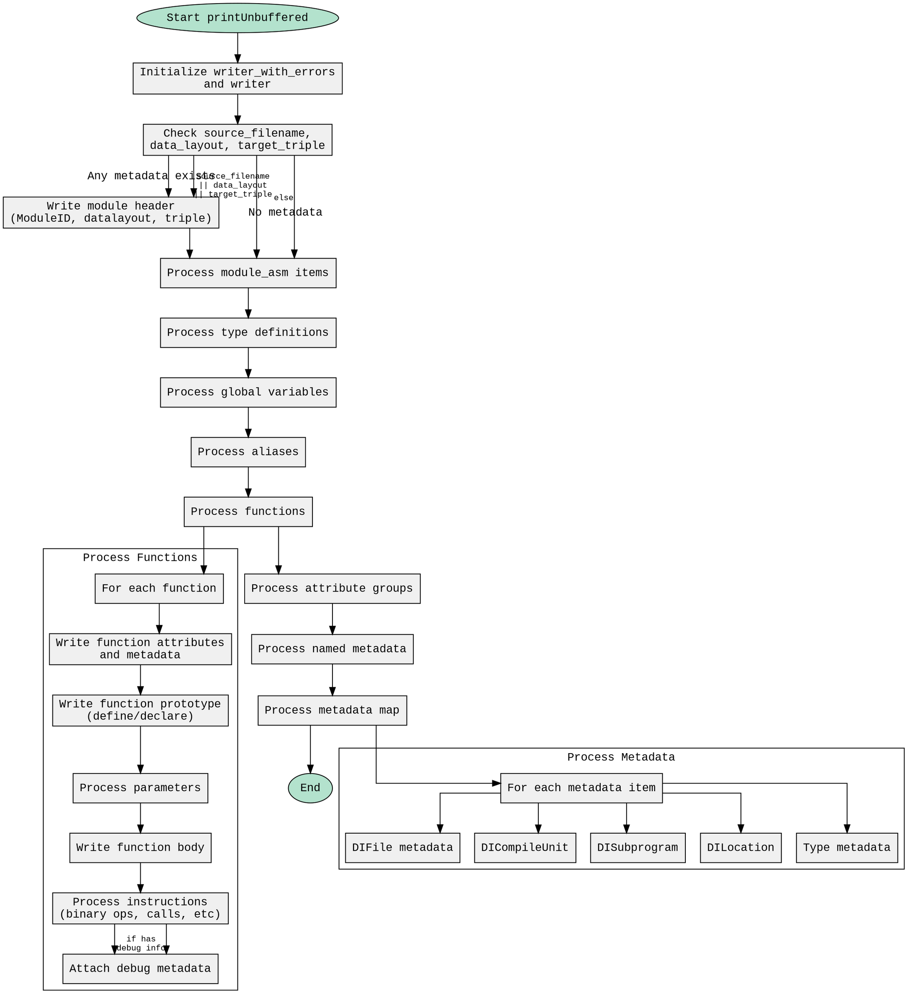

嗯，用户让我用Graphviz来画这个Zig函数的流程图。首先，我需要理解这个函数的结构。函数名是printUnbuffered，看起来是用于生成某种输出，可能和LLVM IR有关。代码里有很多条件判断和循环，处理不同的部分，比如模块信息、变量、函数、元数据等。

流程图应该从函数入口开始，然后按执行顺序画出各个步骤。首先，函数会初始化一些变量，比如writer和metadata_formatter。然后检查是否有源文件名、数据布局或目标三元组，如果有就写入相应的信息。接着处理模块的汇编代码、类型、变量、别名等。

接下来是处理函数部分，这里有很多嵌套的条件和循环，处理函数的各个属性、参数、基本块、指令等。然后处理属性组、元数据，最后处理元数据项的各种情况，比如调试信息、类型描述等。

需要注意的是，函数中有很多条件判断，比如检查self的各种字段是否为空或是否有内容，这些都需要在流程图中体现为不同的分支。循环处理变量、别名、函数等也需要用循环结构表示。

可能遇到的难点是如何处理复杂的嵌套结构和条件分支，尤其是处理元数据时的各种情况。需要确保每个条件分支都正确表示，并且循环结构清晰。另外，函数中有很多错误处理，比如try语句，但流程图可能不需要显示错误处理的细节，除非用户特别要求。

需要将每个主要的代码块转化为流程图中的节点，条件判断作为决策节点，循环作为循环结构。可能还需要将一些重复的代码块抽象为子流程，比如处理不同类型的元数据。

最后，使用Graphviz的语法来组织这些节点和边，确保结构清晰，层次分明。可能需要使用子图来分组相关的处理步骤，比如将所有处理变量的部分放在一个子图中。
================================================

这个流程图使用Graphviz的DOT语言绘制，主要特点包括：

1. 使用正交连线(splines=ortho)保持结构清晰
2. 主要处理流程用垂直方向排列
3. 使用子图(cluster)封装函数处理和元数据处理逻辑
4. 关键条件判断用xlabel标注
5. 节点使用等宽字体(Courier New)保持代码风格
6. 不同颜色区分开始/结束节点和主要处理节点

流程图展示了从初始化writer开始，依次处理模块头信息、汇编代码、类型、变量、别名、函数，最后处理属性组和元数据的完整流程。函数处理和元数据处理部分使用子图封装细节逻辑。