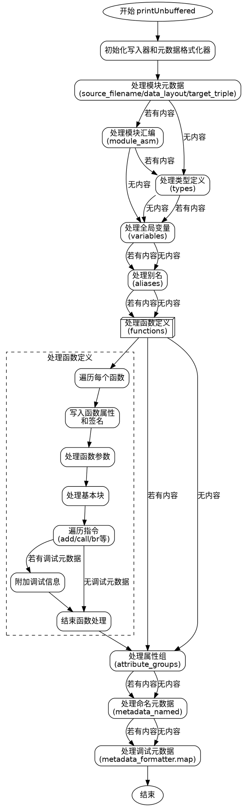

好的，我需要为给定的Zig函数`printUnbuffered`绘制一个流程图。首先，我需要理解这个函数的结构和逻辑流程。

首先，这个函数的作用似乎是将构建器（Builder）中的内容写入到某个写入器（writer）中，可能涉及LLVM IR的生成。函数内部处理了多个部分，比如模块的元数据、模块汇编、类型、变量、别名、函数、属性组、元数据等。

接下来，我需要分解这个函数的各个部分，看看每个部分是如何处理数据的。例如，函数开始时检查`source_filename`、`data_layout`、`target_triple`是否存在，然后写入相应的信息。之后处理`module_asm`、`types`、`variables`、`aliases`、`functions`等。每个部分都有条件判断，比如检查是否有内容需要写入，并在需要时插入换行符。

然后，在处理函数部分时，函数遍历所有的函数，处理每个函数的参数、基本块、指令等。这里有很多条件分支，比如不同类型的指令（如`add`、`call`、`br`等），每种指令有不同的处理方式。

最后，处理属性组和元数据，将相关的元数据信息写入。

为了绘制流程图，我需要将整个函数分解成主要的步骤，并用图形化的方式表示这些步骤之间的流程。可能需要使用不同的形状表示开始/结束、处理步骤、条件判断等。例如：

1. 开始：函数入口。
2. 初始化写入器和元数据格式化器。
3. 检查并写入模块元数据（source_filename, data_layout, target_triple）。
4. 处理模块汇编（module_asm）。
5. 处理类型定义（types）。
6. 处理变量（variables）。
7. 处理别名（aliases）。
8. 处理函数（functions），这里可能包括多个子步骤，如处理参数、基本块、指令等。
9. 处理属性组（attribute_groups）。
10. 处理命名元数据（metadata_named）。
11. 处理其他元数据（metadata_formatter.map）。
12. 结束：函数退出。

每个主要步骤之间可能需要条件判断，例如是否有内容需要处理，是否需要换行等。此外，处理函数部分可能会有复杂的子流程，需要进一步分解。

在绘制流程图时，需要确保逻辑清晰，步骤之间的顺序正确，条件分支明确。可能需要使用菱形表示条件判断，矩形表示处理步骤，箭头表示流程方向。

同时，考虑到代码中存在多个循环（如遍历变量、别名、函数等），在流程图中需要表示这些循环结构，例如使用循环开始和结束的标记。

最后，需要验证流程图是否覆盖了所有主要的代码路径，没有遗漏重要的步骤或条件分支。
================================================
