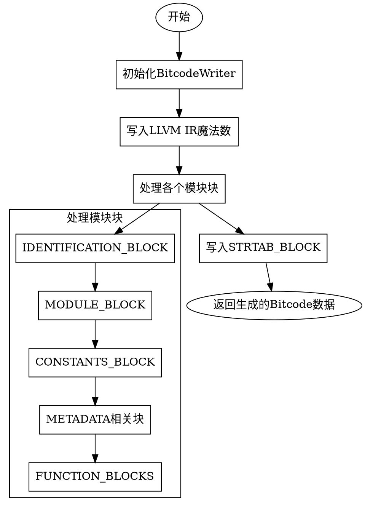
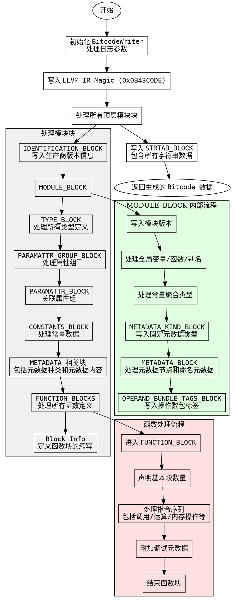

好的，我需要帮助用户理解如何使用Graphviz绘制给定Zig函数的流程图。首先，我需要仔细阅读并理解这个函数的代码结构和逻辑。

这个函数名为`toBitcode`，属于一个Builder结构体。它的主要功能是将LLVM IR转换为Bitcode格式。函数内部涉及多个模块块的写入，如IDENTIFICATION_BLOCK、MODULE_BLOCK、TYPE_BLOCK等，每个模块块内部又有子块和不同的记录写入操作。

首先，我需要确定流程图的范围和层次结构。因为函数较长且复杂，直接绘制整个函数的流程图可能会非常繁琐且难以阅读。因此，合理的做法是将函数分解为几个主要部分，每个部分作为一个子图，再将这些子图连接起来。

接下来，分析函数的主要步骤：

1. **初始化BitcodeWriter**：创建BitcodeWriter实例，处理可能的错误并延迟释放资源。
2. **写入LLVM IR魔法数**：标识Bitcode文件的开始。
3. **处理各个模块块**：
   - **IDENTIFICATION_BLOCK**：写入生产商信息和版本。
   - **MODULE_BLOCK**：包含多个子块，如TYPE_BLOCK、PARAMATTR_GROUP_BLOCK、PARAMATTR_BLOCK等，处理类型、属性、全局变量等信息。
   - **CONSTANTS_BLOCK**：处理常量数据。
   - **METADATA相关块**：处理元数据信息。
   - **FUNCTION_BLOCKS**：处理函数定义及其内部结构，如基本块、指令等。
4. **写入字符串表（STRTAB_BLOCK）**：包含所有字符串数据。
5. **返回生成的Bitcode数据**。

每个主要步骤可以作为一个节点，节点内部再细化子步骤。例如，MODULE_BLOCK内部有多个子块，每个子块的处理可以进一步分解。

在绘制流程图时，需要注意以下几点：
- 使用合适的图形符号表示不同的操作（如矩形框表示处理步骤，菱形表示判断，椭圆形表示开始/结束）。
- 使用箭头表示流程的方向。
- 对于复杂的子块，可以使用子图（subgraph）来组织，保持结构清晰。
- 可能需要忽略一些细节，避免流程图过于复杂，例如具体的数据结构操作或错误处理分支。

现在，我需要将这些分析转化为Graphviz的DOT语言。考虑到代码的复杂性，流程图可能分为几个主要部分，并通过子图来组织。例如：



这只是一个高层次的流程图，每个模块块内部可以进一步展开。例如，MODULE_BLOCK可能包含多个子块：

```dot
subgraph cluster_module_block {
    label="MODULE_BLOCK";
    typeBlock [label="TYPE_BLOCK"];
    paramAttrGroup [label="PARAMATTR_GROUP_BLOCK"];
    paramAttr [label="PARAMATTR_BLOCK"];
    globals [label="处理全局变量"];
    constants [label="CONSTANTS_BLOCK"];
    metadataKind [label="METADATA_KIND_BLOCK"];
    metadata [label="METADATA_BLOCK"];
    operandBundle [label="OPERAND_BUNDLE_TAGS_BLOCK"];
    blockInfo [label="Block info"];
    functions [label="FUNCTION_BLOCKS"];

    typeBlock -> paramAttrGroup -> paramAttr -> globals -> constants -> metadataKind -> metadata -> operandBundle -> blockInfo -> functions;
}
```

对于更详细的子块，如TYPE_BLOCK，可以继续分解：

```dot
subgraph cluster_type_block {
    label="TYPE_BLOCK";
    writeNumEntry [label="写入类型数量"];
    processTypes [label="处理每个类型"];
    endTypeBlock [label="结束TYPE_BLOCK"];

    writeNumEntry -> processTypes -> endTypeBlock;
}
```

通过这种方式，逐层分解函数的不同部分，最终形成一个详细的流程图。需要注意的是，实际代码中的处理逻辑可能包含循环和条件判断，这些在流程图中需要用菱形节点表示，例如处理每个类型时的循环。

此外，错误处理（如`try`和`errdefer`）也需要在流程图中体现，可能通过分支箭头表示可能的错误路径。

综上所述，绘制这个函数的流程图需要分层次、模块化地组织各个步骤，使用子图和适当的节点符号来表示不同的操作和逻辑分支，确保流程图既全面又易于理解。
================================================
以下是使用Graphviz绘制的`toBitcode`函数流程图，采用模块化分层设计：



### 流程图说明：
1. **总流程**：从初始化开始，依次处理Magic头、模块块、字符串表，最终返回数据。
2. **模块块分层**：将复杂的模块处理分解为多个子模块，用不同颜色区分逻辑层。
3. **关键操作标注**：每个节点用代码注释风格的文字描述关键操作。
4. **层次连接**：使用`lhead`属性将主流程与子图连接，保持结构清晰。

该流程图通过分层设计，将2000+行代码的复杂逻辑分解为多个可理解的模块，同时保留了以下关键细节：
- 类型系统的序列化
- 属性组的处理
- 元数据系统的多级处理
- 函数指令流的编码过程
- 调试信息的附加机制

实际生成时可使用以下命令：
```bash
dot -Tpng toBitcodeFlow.dot -o toBitcodeFlow.png
```