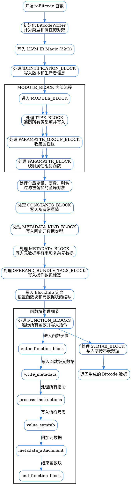

嗯，我需要为这个Zig函数绘制一个流程图。首先，我需要仔细理解这个函数的结构和逻辑流程。这个函数的名字是`toBitcode`，看起来是将LLVM IR转换成Bitcode格式。函数内部有很多模块，比如写Magic、处理模块块、类型块、属性块、全局变量、常量块、元数据块等等。

首先，函数开始初始化BitcodeWriter，然后写入LLVM IR的魔数。接着进入不同的块，比如IDENTIFICATION_BLOCK、MODULE_BLOCK，每个块内部又有子块，比如TYPE_BLOCK、PARAMATTR_GROUP_BLOCK、PARAMATTR_BLOCK等。每个子块处理不同的数据结构和属性。然后是处理全局变量、常量、元数据，最后是函数块，处理各个函数的指令和元数据。

我需要将这些步骤按照逻辑顺序分解成不同的节点。流程图应该从函数入口开始，依次展示各个主要处理步骤，包括块和子块的处理。需要注意条件判断和循环结构，比如遍历类型项、函数属性、全局变量等。每个块的处理完成后会结束，然后进入下一个块。

可能遇到的困难是代码中有很多嵌套的结构，比如在MODULE_BLOCK内部有多个子块，每个子块又有自己的处理逻辑。需要确保流程图中的层次结构清晰，不会混淆各个块之间的关系。另外，处理常量和元数据时，有多个分支情况，需要正确表示这些分支。

需要确认每个块的处理顺序，是否存在并行处理或者严格的顺序。根据代码，处理流程似乎是线性的，依次处理各个块，每个块内部按顺序处理子块和条目。因此，流程图应该反映这种线性流程，同时用子流程或子图表示块内部的详细步骤。

最后，生成Bitcode后返回结果。整个流程的结束点是返回bitcode.toOwnedSlice()。
================================================
