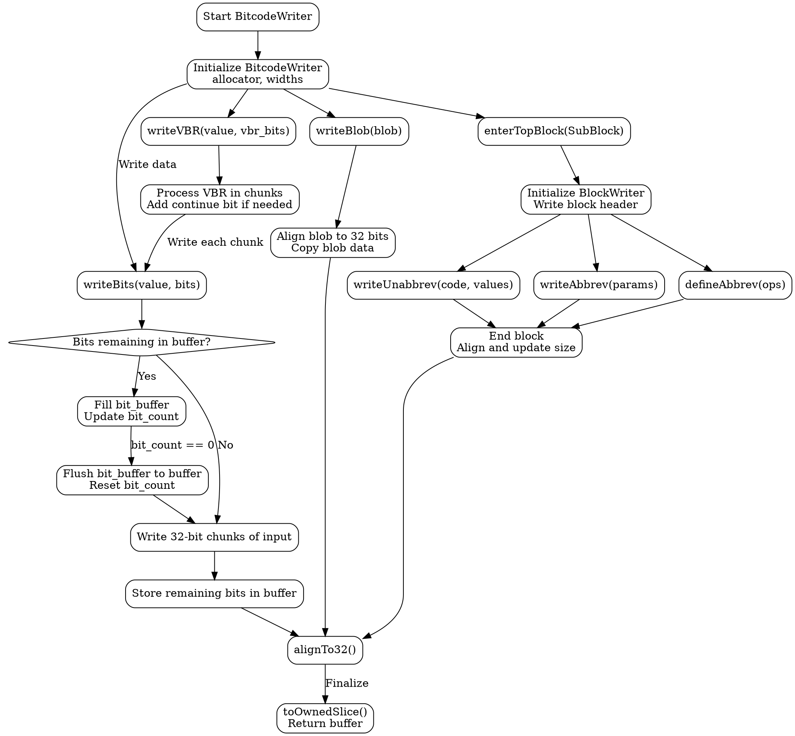

好的，我需要为提供的Zig代码绘制流程图。首先，我需要理解这段代码的功能。看起来这是一个用于生成LLVM Bitcode的BitcodeWriter结构体的实现。该结构体提供了写入位、VBR（可变位率）编码、块操作等功能。

首先，我应该先理清主要函数和结构体的关系。BitcodeWriter函数返回一个结构体，包含多个方法，如writeBits、writeVBR、writeBlob等。每个方法处理不同的编码需求。还有一些内部结构，比如BlockWriter，用于处理子块的写入。

接下来，我需要确定流程图的起点和终点。主流程可能从初始化BitcodeWriter开始，然后根据用户调用不同的写入方法，如写入位、VBR、Blob数据，进入子块，定义缩写等，最后结束块并处理对齐和缓冲区。

在绘制流程图时，需要注意各个方法的调用顺序和条件分支。例如，writeBits方法需要处理缓冲区是否已满，是否需要刷新缓冲区。还有处理不同位数的写入，可能需要分步骤处理。此外，VBR编码涉及循环处理数据块，直到所有数据写入完毕。

BlockWriter结构体涉及到进入和退出子块，需要处理块的开始标记、写入块大小、定义缩写等步骤。这部分可能需要单独的子流程，展示进入子块后的操作，如初始化块、写入数据、结束块时的处理等。

另外，需要处理错误情况，但代码中错误处理主要通过返回Error类型，可能在流程图中用决策节点表示可能的错误路径。

可能遇到的挑战是如何将复杂的位操作和循环逻辑简化为清晰的流程图步骤。需要确保每个步骤的描述准确，同时不过于冗长。可能需要将某些复杂的方法（如writeBits）分解为多个子流程，以保持主流程图的清晰。

总结步骤：
1. 初始化BitcodeWriter。
2. 写入数据（位、VBR、Blob等）。
3. 处理缓冲区，可能刷新或对齐。
4. 进入子块，执行子块相关操作。
5. 定义缩写（如果适用）。
6. 结束子块，更新块大小。
7. 最终对齐并输出缓冲区数据。

在绘制时，使用不同形状表示开始/结束节点、操作步骤、条件判断、循环等。确保每个函数调用和逻辑分支都有对应的节点和连接线。
================================================
