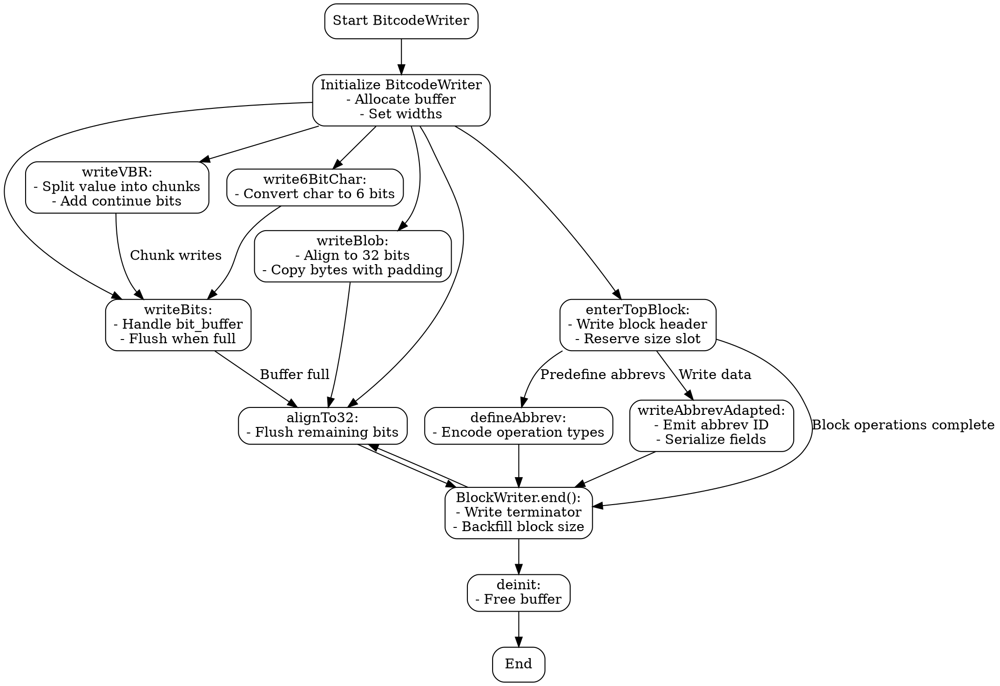

好的，我现在需要根据提供的Zig代码中的`BitcodeWriter`函数来生成一个流程图。首先，我需要仔细阅读代码，理解其结构和各个部分的功能。

首先，`BitcodeWriter`是一个泛型函数，接收一个类型列表`types`，返回一个结构体。这个结构体包含了写入位码的各种方法，比如初始化、写入位、VBR编码、对齐等。结构体内部还有一个嵌套的`BlockWriter`结构体，用于处理块级的写入操作，包括进入子块、结束块、定义缩写等。

接下来，我需要确定流程图的主要组成部分。整个流程可以分为几个大的部分：

1. **初始化BitcodeWriter**：包括初始化缓冲区、设置位宽等。
2. **写入数据**：包括写入普通位、VBR编码、6位字符、二进制数据块等。
3. **块操作**：进入块、定义缩写、写入缩写数据、结束块等。
4. **辅助功能**：对齐到32位、获取类型宽度、转换为自有切片等。

每个部分中的方法需要进一步细分步骤。例如，`writeBits`方法需要处理位缓冲区的管理，当缓冲区填满时将其刷新到主缓冲区。`writeVBR`则需要处理可变位率的编码，分块写入数据。

对于流程图的结构，应该从顶层结构开始，逐步展开每个方法的逻辑。同时，需要注意条件判断和循环结构，例如在`writeBits`中处理剩余位的情况，或者在`writeVBR`中的循环处理大数值。

在绘制流程图时，需要确保每个决策点（如if条件判断）和循环结构正确表示。例如，在`writeBits`中，如果有剩余的位没有填满一个32位缓冲区，需要暂存，直到积累足够的位再写入主缓冲区。

另外，`BlockWriter`的`init`方法涉及写入块的开始标记、块ID、缩写长度，并预留块大小的位置。结束块时需要回填块大小，并处理对齐。这些步骤也需要在流程图中明确展示。

可能遇到的挑战是确保所有错误处理和边缘情况都被涵盖，例如位数为0时的处理，或者在写入不同数据类型时的正确转换。此外，嵌套块的处理需要正确表示层次结构。

最后，需要将所有这些步骤整合到一个连贯的流程图中，使用Graphviz的语法正确表示各个节点和边的关系，确保逻辑清晰，结构合理。
================================================
