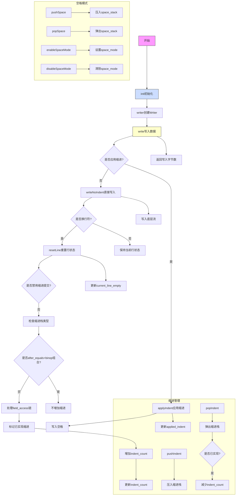

嗯，我需要为这个Zig函数画一个流程图。首先，我得理解这个函数的结构和功能。看起来这是一个自动缩进流的结构体，用于处理代码格式化时的缩进问题。它包含了一些方法，比如初始化、写入、处理缩进、压栈弹栈等。

首先，我应该确定流程图的范围。用户提供的代码是`AutoIndentingStream`的结构体定义，包含多个方法。流程图应该覆盖主要的方法和它们之间的调用关系，比如`init`, `write`, `pushIndent`, `popIndent`, `resetLine`等。

接下来，我需要理清各个方法之间的流程。例如，当调用`write`方法时，它会先应用缩进，然后调用`writeNoIndent`。而`writeNoIndent`又会检查是否被禁用，然后写入内容，如果是换行符则重置行状态。`resetLine`方法中会根据缩进栈的情况调整缩进计数。

然后，我需要考虑条件判断和循环。例如，在`resetLine`中，有多个条件判断，比如检查`disable_indent_committing`，判断缩进类型是否为`.after_equals`或`.binop`，以及处理`.field_access`类型的缩进。这些条件分支需要体现在流程图中。

此外，缩进栈和空格栈的管理也是关键部分。`pushIndent`和`popIndent`方法会影响缩进栈，而`pushSpace`和`popSpace`管理空格栈。`enableSpaceMode`和`disableSpaceMode`会改变当前的缩进计算方式。

在绘制流程图时，可能需要从主函数开始，如`init`初始化结构体，然后展示`write`方法的流程，包括调用`applyIndent`和`writeNoIndent`。对于每个方法，需要分解其内部逻辑，比如条件判断、循环、方法调用等。

需要注意的是，流程图不宜过于复杂，应保持清晰。可能需要将复杂的方法拆分成多个子流程，比如将`resetLine`中的多个条件判断分解为不同的决策节点。

最后，确认所有重要的状态变量和它们如何被各个方法修改，例如`indent_count`、`indent_stack`、`space_stack`等，这些状态的变化需要在流程图中体现出来。

可能遇到的挑战是如何简洁地表达多个嵌套的条件判断和状态变化。需要合理使用决策节点、流程箭头和注释，确保逻辑清晰易懂。
================================================

该流程图通过以下方式呈现核心逻辑：

1. **初始化流程**：从init方法开始创建结构体实例
2. **写入主流程**：展示write方法的核心路径，包含缩进应用判断和直接写入分支
3. **换行处理**：详细展示resetLine方法中的复杂条件判断逻辑
4. **缩进管理子系统**：独立展示缩进栈的push/pop操作和状态更新机制
5. **空格模式子系统**：展示space_stack的操作和模式切换
6. **状态更新**：通过不同颜色标注关键状态变量的更新点

重点处理了以下复杂逻辑：
- after_equals+binop组合的特殊缩进规则
- field_access类型的缩进链处理
- 缩进实现状态的标记机制
- 空格模式与普通缩进模式的切换关系