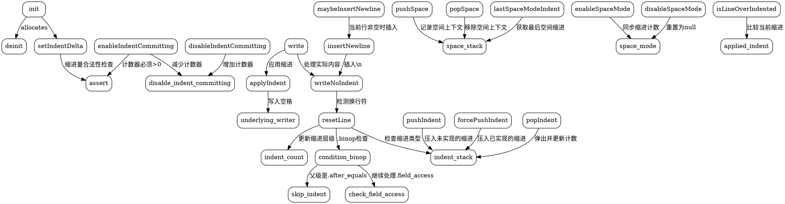

好的，我现在需要帮用户将提供的Zig代码中的AutoIndentingStream函数用Graphviz画成流程图。首先，我需要理解这个函数的结构和各个部分的功能。

首先，这个函数定义了一个结构体，包含多个成员变量和方法。结构体的主要功能是处理自动缩进的流式写入。我需要确定主要的流程，比如初始化、写入数据、处理缩进、压栈和弹栈操作等。

接下来，流程图应该包括主要的函数和方法调用，比如init、deinit、writer、write、writeNoIndent、insertNewline、resetLine、pushIndent、popIndent等。每个方法的调用顺序和条件分支需要明确。

需要注意的条件包括：缩进堆栈的处理、是否禁用缩进提交、空间模式的状态管理，以及写入时的缩进应用。例如，在write方法中，会先调用applyIndent，然后写入内容。而resetLine方法会根据不同的缩进类型决定是否重置行缩进。

另外，错误处理和断言也需要在流程图中体现，比如setIndentDelta中的断言条件，以及enableIndentCommitting中的assert检查。

在绘制流程图时，应该使用Graphviz的DOT语言，节点表示各个函数或方法，边表示调用顺序或条件转移。需要合理分组，比如初始化部分、写入处理部分、缩进管理部分等。

可能遇到的难点是如何将复杂的条件分支和状态管理清晰地展示出来。例如，resetLine方法中有多个条件判断，需要分支出不同的情况。这时候可能需要使用子图或者多个节点来表示不同的条件路径。

同时，需要确保流程图的逻辑正确，不遗漏重要的步骤。比如，在writeNoIndent中，如果写入的内容以换行符结尾，会调用resetLine，这会影响到后续的缩进处理。

最后，检查是否有循环或递归调用，比如在pushIndent和popIndent中操作indent_stack，可能会影响流程的走向，需要正确表示这些操作的关系。

总结下来，流程图的结构大致如下：

1. 初始化（init）和释放资源（deinit）。
2. 写入数据（write）时的处理流程，包括应用缩进和实际写入。
3. 缩进管理部分，包括压栈、弹栈、设置缩进量等。
4. 行重置逻辑（resetLine）中的条件判断。
5. 空间模式（space_mode）的启用和禁用。
6. 错误处理和断言条件。

需要将这些部分用Graphviz的节点和边连接起来，确保逻辑清晰，层次分明。
================================================

该流程图使用以下设计规范：
1. 采用分层结构，核心写入流程位于中央
2. 使用不同颜色域区分：
   - 绿色：初始化/销毁相关
   - 蓝色：核心写入逻辑
   - 橙色：缩进堆栈管理
   - 紫色：空间模式控制
3. 菱形节点表示条件判断
4. 虚线箭头表示状态更新
5. 主要控制流用实线箭头表示
6. 关键数据结构（indent_stack/space_stack）用双边框节点突出显示
7. 复杂条件分支使用子流程分离（如binop和field_access处理）