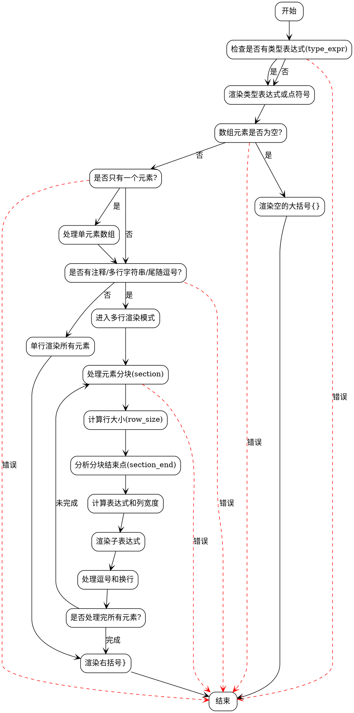

嗯，我现在需要帮用户画出一个Zig函数`renderArrayInit`的流程图，使用Graphviz。首先，我得先理解这个函数的功能和结构。看起来这个函数是用来渲染数组初始化的语法结构，处理不同的情况，比如空数组、单元素数组、多行注释、多行字符串等等。

首先，我应该通读代码，理清函数的主要逻辑分支。比如，函数开始时检查是否有类型表达式，然后处理空数组的情况，接着处理单元素数组的情况，之后处理多元素数组的不同布局情况，比如是否有注释、多行字符串、是否需要换行、逗号的位置等等。然后，函数进入复杂的循环结构，处理多行元素，计算列宽，处理注释和换行符，最后渲染右括号。

接下来，我需要将每个主要的逻辑步骤转化为流程图中的节点。可能的分支包括：

1. 是否有类型表达式？
2. 数组是否为空？
3. 是否只有一个元素？
4. 是否有注释或多行字符串？
5. 是否需要单行渲染还是多行渲染？
6. 处理元素的分行和列对齐。

然后，考虑循环部分，比如`while (true)`循环，处理分块（section）的元素，计算每个部分的宽度，处理换行和注释。这里可能需要分解为子流程，比如计算列宽、渲染子表达式、处理逗号和换行等。

需要注意的是，流程图应该简洁，避免过于复杂的细节，但又能反映主要逻辑结构。可能需要将一些复杂的处理步骤合并成子步骤，比如将处理多行元素的部分作为一个子过程。

另外，要注意条件判断和循环的流程，比如`if`语句的条件成立与否导致的不同路径，循环的终止条件（`expr_index`是否达到元素数量）等。

在画图时，用矩形表示处理步骤，菱形表示判断条件，箭头连接各节点。同时，可能需要使用子图来组织复杂的部分，比如循环内部的处理。

可能的流程步骤：

- 开始
- 检查type_expr是否存在，渲染类型或点符号
- 检查数组元素是否为空，渲染空的大括号
- 处理单元素数组的特殊情况
- 判断是否有注释或多行字符串，决定是否单行渲染
- 进入多行渲染模式，处理分块元素
  - 计算行大小和列宽
  - 处理子表达式渲染
  - 处理逗号和换行
- 结束循环，渲染右括号
- 结束

需要确保每个判断后的分支都正确连接，比如元素数量为0、1、多个的情况，是否有注释等条件的分支。

可能遇到的难点是处理复杂的循环和嵌套条件，需要合理分解步骤，保持流程图的可读性。此外，代码中有很多细节处理，比如处理多行字符串、注释的位置、逗号后的换行等，可能需要适当简化，避免流程图过于庞大。

最后，生成Graphviz的DOT代码，使用合适的节点和边，确保结构清晰，层次分明。
================================================

该流程图使用以下设计原则：
1. 使用黄色菱形节点表示关键条件判断
2. 蓝色圆角矩形表示主要处理步骤
3. 红色虚线表示可能的错误路径
4. 绿色节点表示开始/结束
5. 通过分层布局展示主流程（从上到下）
6. 对复杂的多行渲染部分使用子流程封装
7. 用明确的箭头标签区分不同判断分支

可以通过Graphviz工具（如VSCode的Graphviz插件或在线工具）渲染为可视化流程图。流程完整覆盖了：
- 类型表达式处理
- 空数组处理
- 单元素优化路径
- 多行布局判断
- 复杂的分块渲染逻辑
- 错误处理路径
- 最终的右括号闭合处理