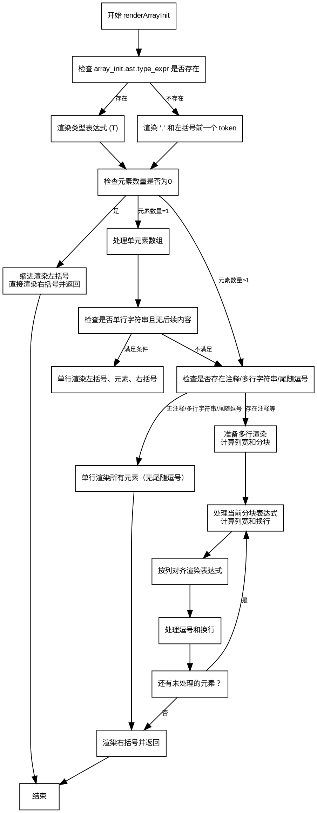

嗯，用户让我用Graphviz来画这个Zig函数的流程图。首先，我需要理解这个函数的结构和逻辑流程。这个函数是renderArrayInit，看起来是用来处理数组初始化的渲染，可能属于某种代码格式化或语法高亮工具的一部分。

首先，我应该通读代码，了解主要的逻辑分支和循环结构。函数开始检查是否有类型表达式，如果有的话就渲染它，否则处理左括号。接着处理空数组的情况，直接渲染左右括号。如果有元素，处理最后一个元素的逗号和右括号的位置。然后根据元素数量、是否存在注释或多行字符串来决定是单行还是多行渲染。

接下来是处理多行的情况，包括计算列宽、处理注释、分配内存等。这里有循环处理每个元素，计算每个表达式的大小，处理换行和注释，最后渲染每个表达式并处理逗号和换行。

我需要将这些逻辑步骤转化为流程图中的节点和判断框。可能的步骤包括：

1. 开始函数。
2. 检查是否有类型表达式，渲染或处理左括号。
3. 检查元素数量是否为0，处理空数组。
4. 处理单元素数组的特殊情况。
5. 检查是否存在注释或多行字符串，决定是否单行渲染。
6. 进入多行渲染逻辑，处理分块、计算列宽、渲染每个元素。
7. 循环处理每个元素，处理逗号和换行。
8. 结束循环，渲染右括号。

需要注意条件判断，比如if语句和循环，这些在流程图中需要用菱形判断框表示。每个主要操作步骤用矩形框，箭头表示流程方向。例如，处理元素是否为空、是否单元素、是否有注释等分支。

还要注意函数中的循环结构，比如while (true)循环和for循环，需要正确表示循环的开始和结束点。可能需要使用子流程或分页处理，但Graphviz中可能需要简化。

另外，函数中有多个返回点，比如在空数组或单元素情况下直接返回，这些应该在流程图中体现为不同的结束路径。但根据代码结构，主流程最后都会渲染右括号并返回，所以可能大部分分支最终汇聚到同一个结束点。

需要确保流程图中的每个判断和操作都正确对应代码的逻辑，避免遗漏重要步骤。同时，注意错误处理和内存分配等部分，但用户可能更关注主流程而非细节。

最后，用Graphviz的DOT语言描述这些节点和连接，合理布局，确保流程图清晰易懂。
================================================
