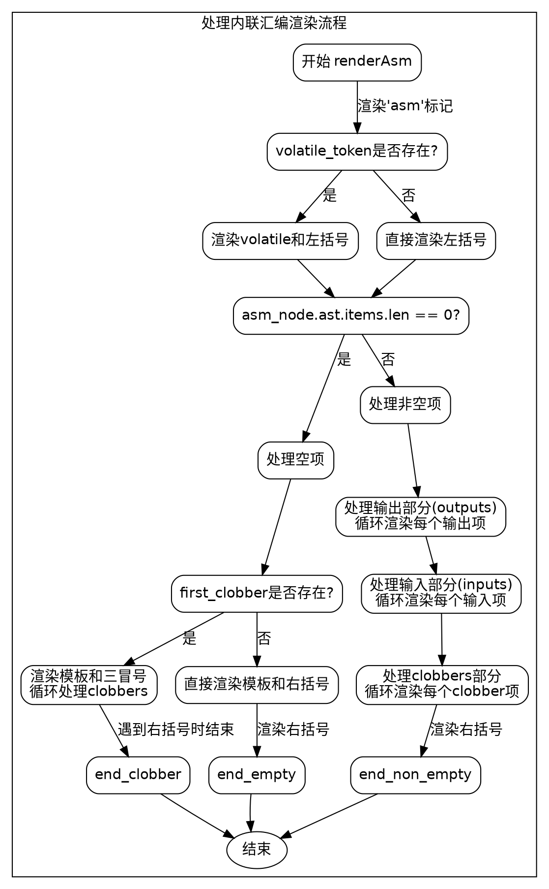

嗯，我现在需要根据提供的Zig代码中的`renderAsm`函数，用Graphviz来画一个流程图。首先，我得理解这个函数的结构和逻辑流程，这样才能准确地画出各个步骤和判断分支。

首先，函数`renderAsm`有三个参数：`r`、`asm_node`和`space`。它处理内联汇编的渲染。看起来函数的主要流程是根据不同的条件来处理不同的标记（token），比如`volatile`是否存在，是否有输出、输入、clobbers等部分。

让我分步骤理清代码的结构：

1. **函数开始**：首先处理`asm`关键字，然后检查是否有`volatile`关键字。如果有，渲染`volatile`和左括号；否则直接渲染左括号。
2. **处理空项的情况**：如果`ast.items`长度为0，可能需要处理没有输出、输入的情况，直接渲染模板字符串和右括号。或者如果有clobbers，渲染三个冒号和相关部分。
3. **非空项的情况**：这里分为处理输出部分（outputs）、输入部分（inputs）和clobbers部分。每个部分都有循环处理各个项，并在适当的位置添加逗号或冒号。
4. **结束处理**：最后处理右括号，并根据不同的条件调整缩进。

接下来，我需要确定各个条件分支和循环的位置，以及它们之间的跳转关系。例如，当`asm_node.volatile_token`存在时，执行某些步骤；否则执行其他步骤。同样，处理outputs、inputs和clobbers时，根据它们的数量是否存在进入不同的处理流程。

在画流程图时，需要注意以下几点：
- **开始和结束节点**：函数入口和返回点。
- **条件判断节点**：如检查`volatile_token`是否存在，`ast.items`长度是否为0，以及各个部分的循环处理。
- **循环结构**：比如处理outputs和inputs时的for循环。
- **处理不同部分的分支**：输出、输入、clobbers各自的处理流程。

可能需要将整个函数分解为多个子流程，比如处理volatile、处理空项、处理非空项中的各个部分等。每个子流程内部可能还有条件判断和循环。

另外，需要注意函数中的`renderToken`和`renderExpression`调用，这些可能是渲染具体标记的步骤，但在流程图中可能不需要详细展开，而是作为处理步骤的节点。

最后，确保流程图的箭头正确连接各个节点，反映代码的执行顺序和条件分支。
================================================
