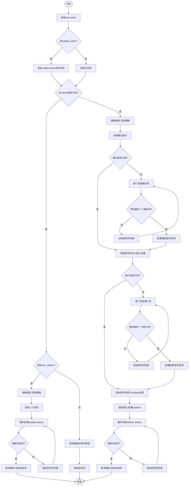

嗯，我现在需要根据提供的Zig代码中的`renderAsm`函数来绘制一个流程图。首先，我得理解这段代码的功能和结构。看起来这是一个处理内联汇编（asm）的渲染函数，可能用于代码格式化或语法高亮之类的工具。函数接收一个`Render`结构体指针、一个`Asm`节点和一个`Space`参数，返回可能的错误或`void`。

首先，我需要理清函数的主要流程。函数一开始处理`asm`关键字和可能的`volatile`关键字。然后根据`asm_node.ast.items`的长度是否为0，分成了两种情况。如果长度为0，再根据是否有`first_clobber`来处理不同的情况，比如是否有clobbers列表；否则直接渲染模板并返回右括号。

如果`ast.items`不为空，则进入更复杂的处理流程，包括处理输出、输入和clobbers部分。每一步都会处理对应的token，调整缩进，并可能递归调用其他渲染函数如`renderExpression`、`renderAsmOutput`、`renderAsmInput`等。

接下来，我需要将这个过程分解成流程图的基本步骤。流程图通常包括开始、结束、判断节点、处理步骤等。我需要确定各个条件分支，比如`if (asm_node.volatile_token)`、`if (asm_node.ast.items.len == 0)`，以及内部的循环结构，如`while (true)`。

需要注意，代码中有多个条件判断和循环，例如在处理clobbers时的循环，以及处理outputs和inputs时的for循环。这些都需要在流程图中正确表示。此外，函数的结束点可能出现在多个地方，比如在渲染右括号时直接返回，或者处理完所有部分后返回。

可能会遇到的困难是正确识别所有可能的执行路径，特别是嵌套的条件和循环。需要仔细检查每个条件分支，确保没有遗漏。例如，当`asm_node.ast.items.len == 0`时，有两种情况：存在`first_clobber`或不存在，这两种情况的处理方式不同。此外，在处理outputs和inputs时，循环内的条件判断也需要正确表达。

另外，代码中使用了`ais.forcePushIndent`和`ais.popIndent`来管理缩进，这在流程图中可能不需要详细表示，但需要知道何时缩进级别变化。不过，流程图的重点在于控制流，而不是具体的缩进处理。

总结一下，流程图的步骤可能如下：
1. 开始函数。
2. 渲染`asm` token。
3. 检查是否有`volatile` token，如果有则渲染。
4. 处理左括号。
5. 检查`ast.items`是否为空。
   - 如果为空：
     - 检查是否存在`first_clobber`。
       - 如果有，处理clobbers列表。
       - 如果没有，直接渲染模板并返回右括号。
   - 如果不为空：
     - 渲染模板表达式。
     - 处理输出部分。
     - 处理输入部分。
     - 处理clobbers部分。
6. 最终渲染右括号并结束。

在绘制流程图时，需要将每个判断点用菱形框表示，处理步骤用矩形框，循环用箭头连接回到循环开始的位置。同时，确保每个分支都有明确的出口，比如返回或进入下一个处理阶段。

需要特别注意循环结构，如`while (true)`在处理clobbers时，需要确定循环的退出条件，通常是遇到右括号或逗号后跟着右括号。同样，在处理outputs和inputs的for循环中，根据索引判断是否继续循环或结束。

可能还需要处理错误情况，但函数返回的是`Error!void`，但代码中可能通过`try`隐式处理错误，流程图中可能不需要特别表示错误路径，除非有特定的错误处理逻辑，但在此代码中似乎没有显式的错误处理分支。

最后，确保所有可能的执行路径都被覆盖，没有无限循环或遗漏的分支。比如，在最后的处理clobbers的循环中，确保每个`switch`的情况都有对应的处理，并最终到达`return`语句。
================================================

流程图说明：
1. 函数入口处理`asm`关键字
2. 根据是否存在`volatile`关键字分支处理
3. 根据内联汇编内容是否为空分两大路径：
   - 空内容时处理clobbers或直接结束
   - 非空内容时依次处理输出、输入、clobbers三部分
4. 每个部分采用相似的循环处理模式：
   - 强制缩进开始
   - 逐个处理项并自动换行
   - 处理尾部逗号/冒号转换
5. 最终统一处理右括号并结束渲染
6. 所有路径最终汇聚到结束节点

该流程图完整反映了：
- 所有条件分支（volatile判断、空内容判断、各部分空判断）
- 循环处理结构（输出项、输入项、clobbers项）
- 缩进控制流程（forcePushIndent/popIndent）
- 多种结束路径的统一收敛