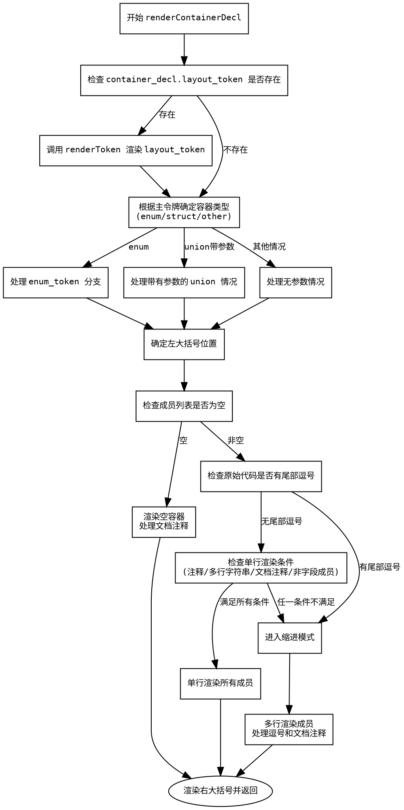

嗯，用户让我用Graphviz画出一个Zig函数的流程图。首先，我需要理解这个函数的结构。函数是renderContainerDecl，看起来是处理容器声明（比如结构体、枚举）的渲染逻辑。我需要理清函数的控制流，比如条件分支、循环等。

首先，函数开始检查是否有layout_token，如果有就渲染。接下来根据主令牌的类型确定容器类型，可能是枚举、结构体或其他。然后处理枚举或联合的情况，处理参数和括号，确定左大括号的位置。之后处理空成员的情况，或者根据是否有逗号、注释等决定是单行还是多行渲染成员。

接下来，我需要把每个条件分支和循环转化为流程图中的节点和判断框。比如，处理container_decl.layout_token是否存在，处理不同的容器类型（enum、struct、union），处理参数是否存在，处理成员是否为空，是否有尾部逗号，是否需要多行渲染等。

需要注意循环部分，比如for循环遍历成员，检查是否有文档注释或非字段成员。这些循环在流程图中可能需要用判断框来表示循环条件，以及循环体内的处理步骤。

还要考虑错误处理，函数返回Error!void，但流程图中可能不需要特别表示错误路径，除非用户有特别要求。用户可能更关注主要的控制流。

确定各个节点之间的连接关系，比如条件分支后的不同路径，循环的继续或退出，最后渲染右大括号并返回。

需要确保流程图的逻辑正确，不漏掉重要的判断步骤，同时保持结构清晰，避免过于复杂。可能需要将一些复杂条件拆分成多个判断节点，以提高可读性。

最后，使用Graphviz的DOT语言来描述流程图，用节点表示操作，菱形表示条件判断，箭头表示流程方向。确保每个分支都有明确的出口，循环结构正确表示。
================================================
