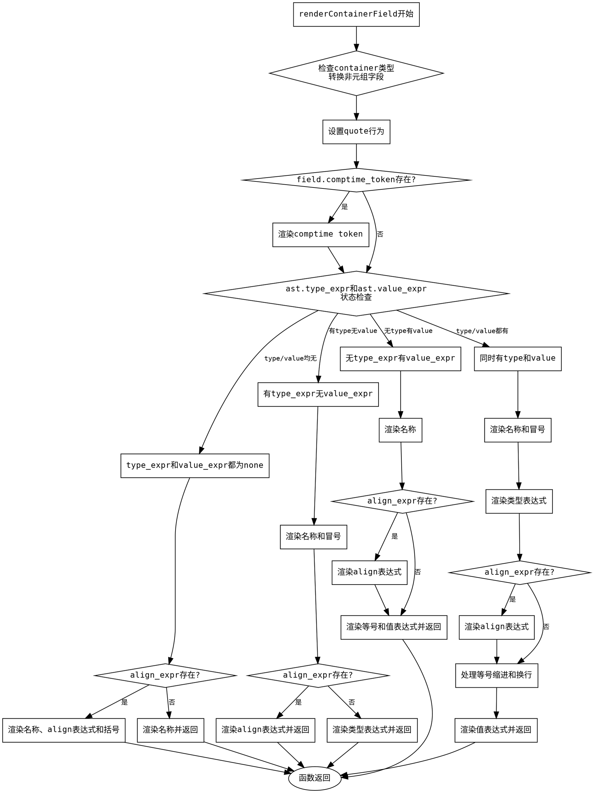

嗯，用户让我用Graphviz来画这个Zig函数的流程图。首先，我需要理解这个函数的结构。这个函数叫做renderContainerField，看起来是处理容器字段的渲染逻辑。函数内部有很多条件判断，根据不同的情况处理不同的字段结构。

首先，我应该通读代码，确定主要的控制流。函数开头检查container是否是tuple，如果不是的话，调用convertToNonTupleLike。接着根据container类型设置quote的行为。然后有多个条件分支，处理不同的字段情况：是否有comptime_token，是否有类型表达式、值表达式，或者两者都有。

接下来，我需要识别每个条件分支的结构。例如，第一个条件检查field.comptime_token是否存在，存在的话渲染token。然后检查type_expr和value_expr的情况，分成了几种不同的情况：两者都为空，只有type_expr，只有value_expr，以及两者都有。每个分支内部还有可能处理align_expr的情况，这又增加了更多的子分支。

然后，函数在处理对齐表达式时，会有渲染align关键字、括号和对齐表达式的逻辑。在处理赋值时，还有处理等号后面的缩进和换行的情况，比如根据是否在同一行决定使用空格还是换行，以及可能的逗号处理。

画流程图的时候，应该从函数入口开始，逐步根据条件分支展开。每个条件判断（如if语句）对应一个菱形节点，不同的分支指向不同的处理步骤。处理步骤中的函数调用，如renderToken、renderIdentifier等，可以用矩形节点表示。注意各个分支的结束点，比如return语句，可能会导致流程提前结束。

需要注意的是，有些分支内部有嵌套的条件判断，比如在处理type_expr和value_expr都存在的情况下，还有处理align_expr的情况。这时候需要将这些嵌套的条件也表现在流程图中，可能需要使用子图或者更复杂的节点连接。

另外，函数中有些部分调用了其他函数，比如renderExpression、renderTokenComma等，这些在流程图中可能需要简化为一个步骤，除非用户特别要求展开这些函数的内部逻辑。

最后，要确保流程图的箭头正确反映了程序的执行路径，包括循环和返回点。可能还需要处理错误情况，但在这个函数中错误处理是通过Error!void返回类型，可能没有显式的错误分支，除非有try语句失败时提前返回，这在流程图中可能需要体现。

总结一下，流程图的大致结构是：

1. 函数开始，处理container类型和quote设置。
2. 检查comptime_token，渲染。
3. 检查type_expr和value_expr的情况，进入不同的分支。
4. 每个分支内部可能处理align_expr，并渲染相应的token和表达式。
5. 处理等号和值表达式时的不同缩进和换行情况。
6. 最后返回。

需要确保每个条件分支都有正确的连接，特别是嵌套的条件和可能的提前返回点。
================================================

该流程图使用Graphviz的DOT语言描述，主要特点：

1. 使用菱形节点表示条件判断（if语句）
2. 矩形节点表示处理步骤和函数调用
3. 清晰展示了四种主要分支情况：
   - 无类型无值
   - 有类型无值
   - 无类型有值
   - 类型和值都有
4. 包含对齐表达式（align_expr）的嵌套处理
5. 最终返回路径统一指向end节点
6. 使用等宽字体保持代码对齐风格
7. 完整覆盖原函数所有逻辑分支

可以使用Graphviz工具（如dot命令）生成图片：  
`dot -Tpng flowchart.dot -o flowchart.png`