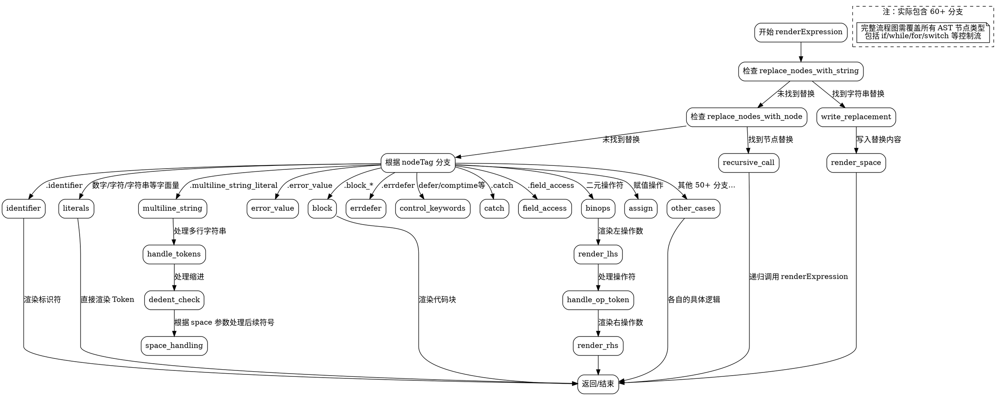

好的，我现在需要根据用户提供的Zig代码中的`renderExpression`函数来绘制一个流程图。首先，我需要仔细阅读并理解这段代码的结构和逻辑流程。

首先，函数`renderExpression`接受三个参数：一个`Render`结构体的指针、一个AST节点的索引和一个`Space`枚举。函数的主要任务是根据不同的AST节点类型来渲染相应的表达式。

我注意到函数一开始检查了两个替换映射（`replace_nodes_with_string`和`replace_nodes_with_node`），如果找到替换项，就直接使用替换后的内容进行渲染。接着是一个大的`switch`语句，根据不同的节点标签（`nodeTag`）执行不同的渲染逻辑。

每个`case`分支处理不同类型的AST节点，例如标识符、字面量、块语句、错误处理结构（如`errdefer`、`catch`）、操作符表达式（如赋值、二元运算）、函数调用、容器声明等等。每个分支内部可能有条件判断、循环或其他函数调用，比如`renderToken`、`renderIdentifier`、`renderBlock`等。

接下来，我需要将这些逻辑步骤转化为流程图。流程图的开始是函数入口，然后根据不同的条件分支展开。由于代码中存在大量的分支（每个`case`），流程图会非常复杂，需要考虑每个分支的处理流程，以及可能的递归调用（例如在`replace_nodes_with_node`的情况下会递归调用`renderExpression`）。

需要注意的地方包括：
1. 初始的替换检查，可能导致直接返回或递归调用。
2. 每个`case`分支的具体处理逻辑，例如`multiline_string_literal`处理多行字符串后的缩进调整。
3. 各种操作符和表达式的处理，如赋值、二元运算、字段访问等。
4. 特殊结构如`switch`、`while`、`for`、`if`的处理。
5. 错误处理部分，如`error_value`和`error_union`。

在绘制流程图时，需要将这些分支和子处理过程用不同的节点表示，并用箭头连接它们以显示控制流。例如，开始节点后，首先检查替换映射，如果有则处理替换，否则进入`switch`语句。每个`case`分支对应一个决策节点，然后根据不同的处理步骤展开子流程。

由于代码较长且复杂，可能需要将流程图分成多个部分，或者使用子图来组织不同的分支，以保持可读性。此外，需要注意递归调用的情况，确保在流程图中正确表示循环或重复的过程。

最后，需要确保使用Graphviz的正确语法，避免使用Mermaid，并正确设置节点和边的属性，使流程图清晰易懂。
================================================
