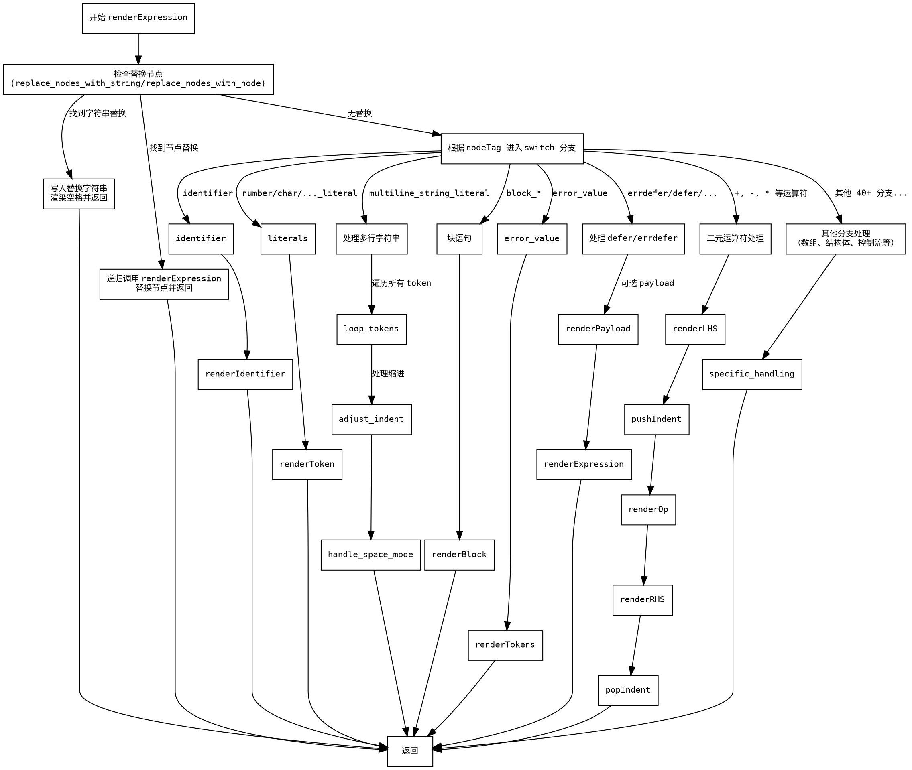

嗯，用户让我用Graphviz画一个Zig函数的流程图。首先，我需要理解这个函数的结构。这个函数叫做renderExpression，看起来是用来渲染AST节点的不同表达式的。函数内部有很多条件判断和switch case，处理不同类型的节点。

首先，我应该先分析函数的主要结构。函数开始检查是否有替换节点的情况，如果有的话就直接使用替换内容。然后进入一个大的switch语句，根据不同的节点类型执行不同的渲染逻辑。每种节点类型对应的处理方式可能不同，比如处理标识符、字面量、块语句、错误处理等等。

接下来，我需要确定如何将这些逻辑转换为流程图。流程图通常包括开始、结束、判断节点和操作节点。对于这个函数，开始是函数入口，结束是函数返回。中间的每个条件判断和switch case都是不同的分支。

可能的步骤：
1. 开始节点：函数入口。
2. 检查是否有替换节点（replace_nodes_with_string或replace_nodes_with_node），如果有，处理替换并返回。
3. 如果没有替换，进入switch语句，根据不同的节点类型处理。
4. 每个case分支处理对应的节点类型，可能会有子函数调用，如renderIdentifier、renderToken等。
5. 处理完毕后，返回或继续处理其他部分。

需要注意的是，switch语句中的每个case可能包含复杂的逻辑，比如循环、条件判断等。这些也需要在流程图中体现出来。例如，处理multiline_string_literal时有循环处理多个token，以及后续的缩进调整。

另外，有些节点处理后会直接返回，有些则可能继续执行后续的代码。需要明确每个分支的结束点。

可能的挑战：
- 处理大量的case分支，如何简洁地表示在流程图中。
- 处理嵌套的条件判断和循环，确保流程图的逻辑清晰。
- 确定每个case中的关键步骤，避免流程图过于复杂。

可能需要将主要分支作为独立的判断节点，而将具体处理步骤简化为操作节点。对于特别复杂的case，可以单独展开或用注释说明。

总结，流程图的大致结构是：
开始 -> 检查替换节点 -> 是则处理并返回，否则进入switch -> 根据节点类型进入不同分支 -> 各分支处理并返回。

现在需要将这些逻辑转化为Graphviz的DOT语言，使用节点和边来表示流程。
================================================
