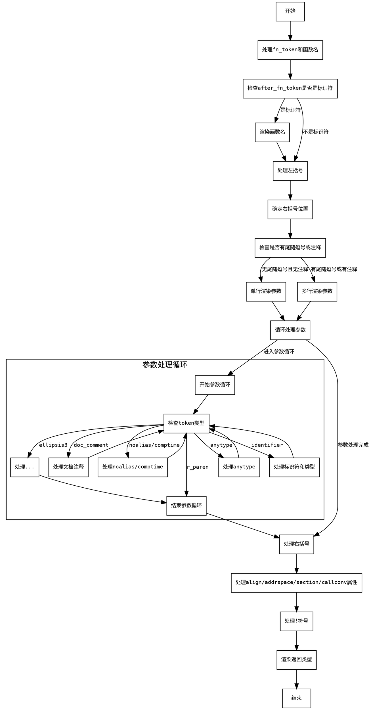

嗯，我需要用Graphviz来画这个函数的流程图。首先，我得仔细看看这个函数的结构。函数名是renderFnProto，看起来是处理函数原型的渲染。函数内部有很多条件判断和循环，可能涉及不同的代码路径。

首先，我需要理清函数的整体流程。函数开始处理fn_proto的fn_token，然后是参数列表的处理，可能有不同的情况，比如是否有参数名，是否有注释，参数之间的逗号处理等等。接着处理返回类型，可能还有一些修饰符，比如align、addrspace、section、callconv。最后处理返回类型的表达式。

接下来，我需要把每个主要的步骤分解成流程图中的节点。可能包括：

1. 处理fn_token和函数名。
2. 处理左括号和参数列表，分为两种情况：是否有尾随逗号或注释。
3. 参数列表的循环处理，包括不同类型的参数（比如doc_comment、ellipsis、关键字等）。
4. 处理右括号。
5. 处理各种修饰符（align、addrspace、section、callconv）。
6. 处理返回类型前的可能存在的!符号。
7. 最后渲染返回类型。

需要注意条件分支，比如if (!trailing_comma && !hasComment(...))，这时候会有两种不同的处理路径。每个条件判断都应该在流程图中体现为分支节点。

另外，循环结构比如while (true)也需要用循环节点表示。可能需要使用子图来更清晰地表示循环部分。

还要注意函数的错误处理，比如try语句，但在流程图中可能不需要特别表示错误路径，除非特别重要。

接下来，我需要将这些步骤转化为Graphviz的节点和边。使用不同的形状表示不同的结构，比如菱形表示条件判断，矩形表示处理步骤，箭头表示流程方向。

需要注意节点之间的连接是否正确，尤其是条件分支后的不同路径。例如，处理参数列表时，如果有尾随逗号或注释，则进入多行处理，否则单行处理。

可能还需要处理各个修饰符的条件判断，比如是否存在align_expr等，这些也需要在流程图中体现。

最后，确保整个流程图的连贯性，没有遗漏任何关键步骤或条件判断。
================================================
