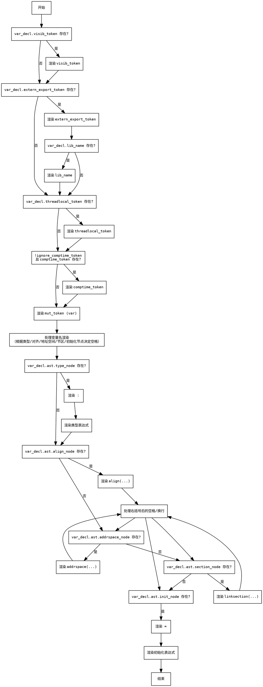

嗯，我需要为给定的Zig函数`renderVarDeclWithoutFixups`绘制一个流程图。首先，我得仔细阅读并理解这个函数的逻辑结构。这个函数负责渲染变量声明，处理各种可能的修饰符和子句，比如可见性、extern、线程局部、comptime等，然后是变量名、类型、对齐、地址空间、节区以及初始化表达式。

首先，函数开始时会检查`var_decl.visib_token`是否存在，如果存在，渲染该可见性令牌，比如`pub`。接着处理`extern_export_token`，如果有的话，渲染`extern`或`export`，并可能有一个库名称。然后是`threadlocal_token`，渲染`threadlocal`。如果`ignore_comptime_token`为假，还要处理`comptime_token`，渲染`comptime`。

接下来，渲染`mut_token`（即`var`或`const`）。然后根据是否有类型节点、对齐节点、地址空间节点、节区节点或初始化节点来决定如何渲染变量名。如果有这些节点中的任何一个，变量名后面可能需要空格，否则直接使用传入的`space`参数。

之后，处理类型节点，如果有的话，渲染冒号和类型表达式。然后是处理对齐节点，包括`align`关键字、括号和表达式。类似地处理地址空间节点和节区节点，每个都可能需要渲染关键字、括号和表达式，并根据后续是否存在其他节点来决定右括号后的空格或换行。

最后处理初始化表达式，找到等号令牌，确定等号后的空格或换行，缩进后渲染等号和初始化表达式，最后弹出缩进。

流程图的开始应该是函数的入口，然后按照条件分支依次处理各个部分。每个条件判断对应一个分支，比如是否有可见性令牌、extern_export_token等。每个处理步骤后可能需要继续处理后续的节点，或者根据条件跳转到不同的分支。

需要注意的是，在处理对齐、地址空间、节区节点时，每个部分都可能影响后续的渲染方式，比如右括号后的空格或换行取决于后续是否有其他节点。最后的初始化部分需要处理等号和表达式的渲染，并处理缩进。

在绘制流程图时，应该用矩形框表示处理步骤，菱形框表示条件判断，箭头表示流程走向。要确保所有条件分支都被覆盖，比如每个`if`语句对应的“是”和“否”路径。同时，注意处理完各个修饰符后，如何进入类型、对齐等部分的处理，以及最后的初始化部分。

可能容易出错的地方是条件判断的顺序和嵌套关系，比如在处理类型节点之后才会处理对齐节点，而对齐节点之后是地址空间节点，依此类推。每个节点的处理可能会影响后续的渲染方式，比如右括号后是否需要空格或换行。此外，初始化部分的等号令牌和缩进处理也需要正确表示。

总之，流程图应该从函数入口开始，按照代码的逻辑顺序，依次处理各个可能的修饰符和子句，每个条件判断分支正确，处理步骤清晰，最终结束于函数的返回或结束点。
================================================
