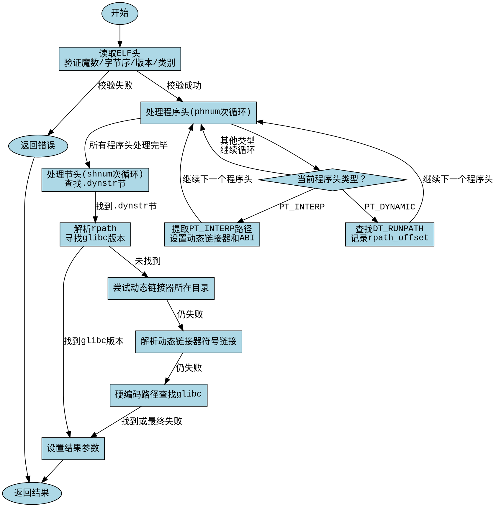

好的，我需要为提供的Zig函数`abiAndDynamicLinkerFromFile`绘制一个流程图。首先，我得仔细阅读代码，理解它的结构和逻辑流程。

这个函数的主要目的是从ELF文件中提取ABI和动态链接器信息。它处理ELF头，检查各种段（如PT_INTERP和PT_DYNAMIC），并根据这些信息设置目标平台的配置。看起来函数涉及多个步骤，包括读取ELF头、处理程序头（program headers）、处理动态段（dynamic segments）、查找动态链接器路径以及确定glibc版本等。

首先，我应该分解函数的步骤：

1. **读取ELF头**：验证ELF魔数、字节序、版本和类别（32位或64位）。
2. **处理程序头（Program Headers）**：遍历每个程序头，查找PT_INTERP（动态链接器路径）和PT_DYNAMIC（动态段信息）。
3. **处理PT_INTERP**：提取动态链接器路径，并根据路径确定ABI。
4. **处理PT_DYNAMIC**：查找DT_RUNPATH以确定rpath。
5. **处理节头（Section Headers）**：查找.dynstr节，解析rpath以寻找glibc版本。
6. **备用方法查找glibc版本**：如果前面步骤失败，尝试通过动态链接器路径或硬编码路径查找。

接下来，我需要将这些步骤转化为流程图的结构。每个步骤可能包含条件判断（如是否找到某个段或路径），需要分支处理。例如，在处理程序头时，需要判断是PT_INTERP还是PT_DYNAMIC，并执行不同的操作。同样，如果查找rpath失败，可能需要尝试其他方法。

需要注意的是，代码中有多个循环，比如遍历程序头和节头，这在流程图中需要用循环结构表示。同时，错误处理（如返回错误）也需要在流程图中体现。

另外，流程图中应该包括开始和结束节点，每个处理步骤用矩形表示，判断用菱形，箭头表示流程方向。确保每个可能的路径都有正确的连接，包括错误返回和成功返回的情况。

可能遇到的挑战是如何简化复杂的循环和条件判断，使流程图清晰易懂。例如，处理多个程序头和节头时的循环结构需要合理表示，避免过于复杂。

总结步骤后，可以开始绘制流程图的大纲：

- 开始
- 读取ELF头并验证
  - 失败则返回错误
- 处理程序头
  - 遍历每个程序头
    - 如果是PT_INTERP，提取动态链接器路径
    - 如果是PT_DYNAMIC，查找DT_RUNPATH
- 处理节头查找.dynstr
  - 解析rpath寻找glibc版本
- 如果失败，尝试其他方法（动态链接器路径、硬编码路径）
- 设置结果并返回

在绘制时，需确保每个判断点的分支正确，并处理所有可能的错误路径。同时，需要合理组织结构，避免交叉线过多，保持流程图的可读性。
================================================
