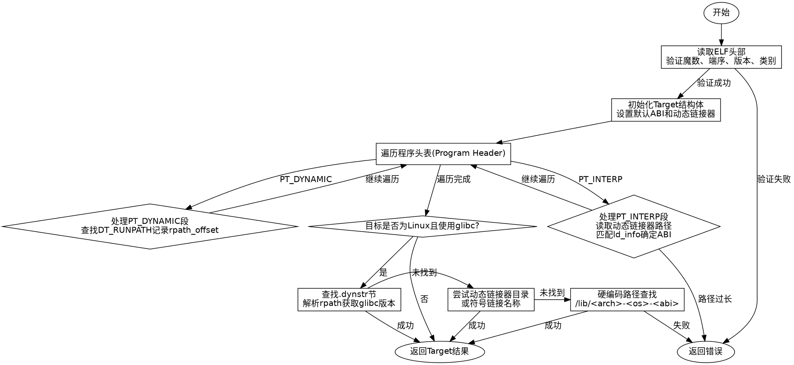

嗯，我现在需要为这个Zig函数`abiAndDynamicLinkerFromFile`画一个流程图。首先，我得先理解这个函数是做什么的。看起来这个函数主要是处理ELF文件，提取ABI和动态链接器的信息。函数接收一个文件句柄、CPU信息、操作系统信息、ld_info列表和一个查询对象，然后返回目标信息或者错误。

首先，函数开始时会读取ELF文件的头部，检查魔数、端序、版本和类别（32位或64位）。这部分应该对应流程图的开始部分，包括读取头部、验证ELF魔数、确定端序、检查版本和ELF类别。如果其中任何一步失败，就会返回错误。

接下来，函数初始化一个`Target`结构体，设置默认的ABI和对象格式。然后处理程序头表（Program Header），遍历每个程序头条目，寻找PT_INTERP和PT_DYNAMIC段。PT_INTERP用于获取动态链接器的路径，而PT_DYNAMIC可能用于查找glibc版本。这里可能会有条件分支，比如是否在寻找动态链接器，或者是否需要处理PT_DYNAMIC段。

在处理PT_INTERP时，读取动态链接器的路径，并根据这个路径确定ABI。这里有一个循环遍历`ld_info_list`，比较路径的basename，找到匹配的ABI。这部分需要循环结构，可能会有多个条件判断。

然后是处理PT_DYNAMIC段，特别是DT_RUNPATH条目。这里需要读取动态段，查找特定的标签（如DT_RUNPATH），记录rpath_offset。这部分可能涉及嵌套循环，遍历动态条目。

接下来，如果目标操作系统是Linux且使用glibc，函数会尝试从.dynstr节中读取rpath，解析glibc版本。如果找不到，可能会回退到动态链接器所在的目录，或者检查动态链接器的符号链接名称，以确定glibc版本。最后，如果所有方法都失败，会尝试硬编码的搜索路径，比如`/lib/<arch>-<os>-<abi>/`。

整个流程中，有很多条件判断、循环和错误处理。需要注意各个步骤之间的依赖关系，比如只有在某些条件满足时才会执行后续步骤。例如，只有在`look_for_ld`为真时才会处理PT_INTERP段，或者只有在Linux和glibc环境下才会处理PT_DYNAMIC和后续的版本查找。

在画流程图的时候，应该用不同的形状表示开始/结束、处理步骤、判断分支、循环等。例如，开始和结束用椭圆，处理步骤用矩形，判断用菱形，循环用带有箭头的线连接。需要确保每个条件分支都有明确的是/否路径，循环结构清晰，比如用箭头回到循环开始处。

另外，错误处理部分需要特别标注，比如返回错误的不同情况，可能在多个步骤中出现错误，如无效的ELF魔数、无效的端序等。这些错误应该直接指向流程图的终止节点，或者集中处理错误返回。

可能还需要注意一些细节，比如变量`ph_i`和`dyn_i`的循环控制，确保循环正确结束。在处理不同ELF结构（32位和64位）时的类型转换和内存对齐，这部分可能影响流程的分支，但可能在流程图中不需要详细体现，除非对理解流程至关重要。

总结一下，流程图的步骤大致如下：

1. 开始
2. 读取ELF头部，验证魔数、端序、版本、类别
3. 初始化Target结构体
4. 遍历程序头表
   a. 处理PT_INTERP段，获取动态链接器路径，确定ABI
   b. 处理PT_DYNAMIC段，查找DT_RUNPATH
5. 如果是Linux且使用glibc：
   a. 查找.dynstr节，解析rpath
   b. 尝试从动态链接器路径、符号链接或硬编码路径获取glibc版本
6. 返回结果或错误

每个步骤中的条件分支需要明确，比如是否找到PT_INTERP，是否成功解析版本等。错误路径应直接返回，成功路径继续执行后续步骤。

现在需要将这些步骤转化为Graphviz的节点和边，确保逻辑正确，结构清晰。
================================================
