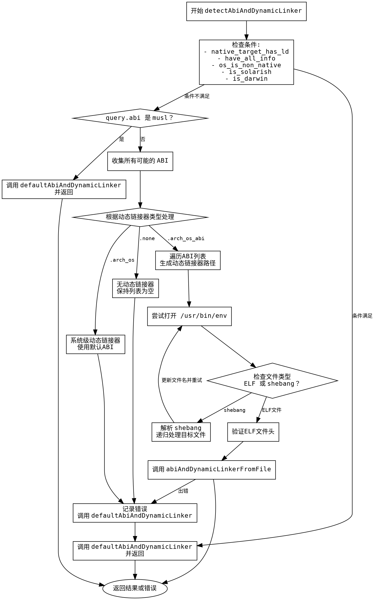

好的，我现在需要根据用户提供的Zig代码中的`detectAbiAndDynamicLinker`函数，用Graphviz画出它的流程图。首先，我需要仔细理解这个函数的结构和逻辑，然后将其分解成不同的步骤和条件分支，以便绘制出准确的流程图。

首先，我会通读整个函数，了解它的主要功能。看起来这个函数的作用是检测系统的ABI（应用程序二进制接口）和动态链接器。函数接收CPU、操作系统和目标查询作为参数，并返回检测到的目标或错误。

接下来，我需要分解函数的各个部分：

1. **变量声明和条件判断**：函数一开始声明了几个布尔变量，如`native_target_has_ld`、`is_linux`等，然后根据这些变量的组合条件决定是否调用`defaultAbiAndDynamicLinker`。如果满足某些条件（比如非本机操作系统、已经拥有所有信息等），就直接返回默认的ABI和动态链接器。

2. **处理musl ABI的情况**：如果查询中的ABI是musl，则同样调用默认处理函数，因为musl通常使用静态链接。

3. **收集所有可能的ABI**：通过反射获取所有可能的ABI类型，并构建一个ABI列表。这里需要注意Zig的元编程特性，比如`comptime`关键字，这在流程图中可能需要特别标记，因为它是在编译时执行的。

4. **动态链接器类型的处理**：根据操作系统的动态链接器类型（none、arch_os、arch_os_abi），执行不同的逻辑。特别是对于`arch_os_abi`类型，会遍历所有可能的ABI，生成对应的动态链接器路径，并填充到`ld_info_list`中。

5. **ELF文件处理**：尝试打开`/usr/bin/env`（或其他路径，如Haiku系统的`/bin/env`）来检查是否为ELF文件或包含shebang脚本。如果是shebang脚本，递归解析直到找到实际的ELF文件。这一步涉及到文件操作和错误处理，需要详细分解。

6. **错误处理**：在整个过程中，遇到错误时会记录并回退到默认处理。错误处理部分需要体现在流程图中，尤其是各种可能的错误分支。

在绘制流程图时，需要注意以下几点：

- **开始和结束节点**：函数开始和返回的位置。
- **条件判断节点**：如各种if语句和switch语句。
- **循环结构**：例如遍历ABI列表的循环。
- **函数调用**：如调用`defaultAbiAndDynamicLinker`和`abiAndDynamicLinkerFromFile`。
- **错误处理流程**：捕获错误并转向相应的处理路径。
- **递归解析shebang**：这部分可能需要循环结构来表示重复解析过程。

可能的挑战包括：

- **递归解析shebang**：在流程图中如何清晰地表示递归或循环解析文件的过程，可能需要使用循环节点或子流程。
- **复杂的条件组合**：多个布尔变量的组合条件判断需要准确分解，避免遗漏分支。
- **错误处理分支较多**：需要确保所有错误情况都被覆盖，并在流程图中正确表示。

为了确保流程图的准确性，我需要再次检查代码中的每个条件分支和可能的执行路径，确保每个判断和操作都被正确映射到流程图中的节点和边。此外，需要注意代码中的注释，它们可能提供额外的逻辑信息，比如某些特定操作系统（如Haiku）的特殊处理。

最后，将所有这些元素整合到Graphviz的DOT语言中，使用合适的节点形状（如菱形表示判断，矩形表示操作，椭圆形表示开始/结束）和箭头连接，形成完整的流程图。
================================================

这个流程图的关键特点：
1. 使用菱形节点表示条件判断
2. 用矩形表示操作步骤
3. 错误处理统一汇聚到handle_error节点
4. 递归解析shebang用循环箭头表示
5. 包含编译时操作（如收集ABI）的表示
6. 主要逻辑分支清晰可见：
   - 初始条件快速返回
   - musl特殊处理
   - 动态链接器类型分派
   - ELF文件解析流程
   - 错误回退机制

可以通过Graphviz工具（如dot命令）渲染生成矢量图。建议使用层级布局优化显示效果。