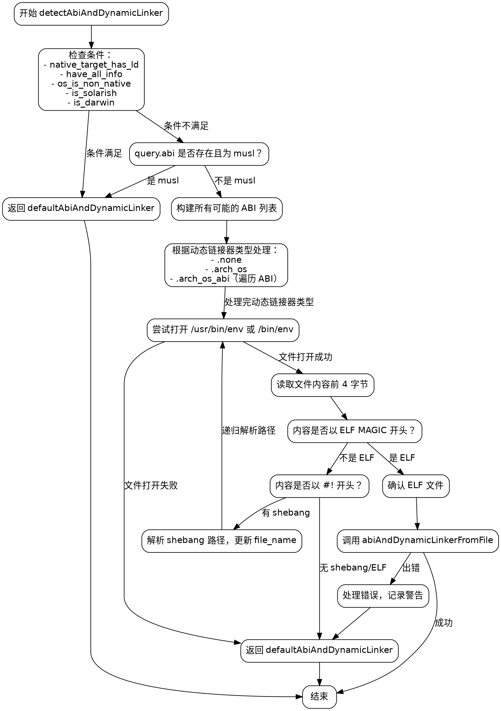

嗯，我需要为这个Zig函数`detectAbiAndDynamicLinker`画一个流程图。首先，我得仔细阅读代码，理解它的逻辑结构。

函数一开始声明了一些布尔变量，比如`native_target_has_ld`、`is_linux`等，然后根据这些条件判断是否直接返回`defaultAbiAndDynamicLinker`。接下来，如果有`query.abi`且是musl，同样返回默认处理。

然后，函数构建了所有可能的ABI列表，并根据动态链接器的类型处理不同的情况。如果是`.arch_os_abi`类型，会遍历所有ABI生成动态链接器信息。

接着，函数尝试打开`/usr/bin/env`或`/bin/env`文件，检查是否是ELF文件或者包含shebang行。如果是shebang，递归解析直到找到ELF文件。找到ELF文件后，调用`abiAndDynamicLinkerFromFile`进行处理，如果出错则回退到默认处理。

流程图应该从函数入口开始，分支判断各个条件，处理不同的情况，包括错误处理路径。需要注意递归解析shebang的部分，可能需要循环结构。另外，错误处理部分有很多不同的错误类型，需要适当合并或简化，避免流程图过于复杂。

可能需要使用条件判断框、处理步骤框、循环框，以及错误处理的返回路径。需要确保每个判断分支清晰，特别是多个if条件和switch case的情况。最后，确保所有可能的执行路径都被覆盖，包括正常流程和错误回退。
================================================
