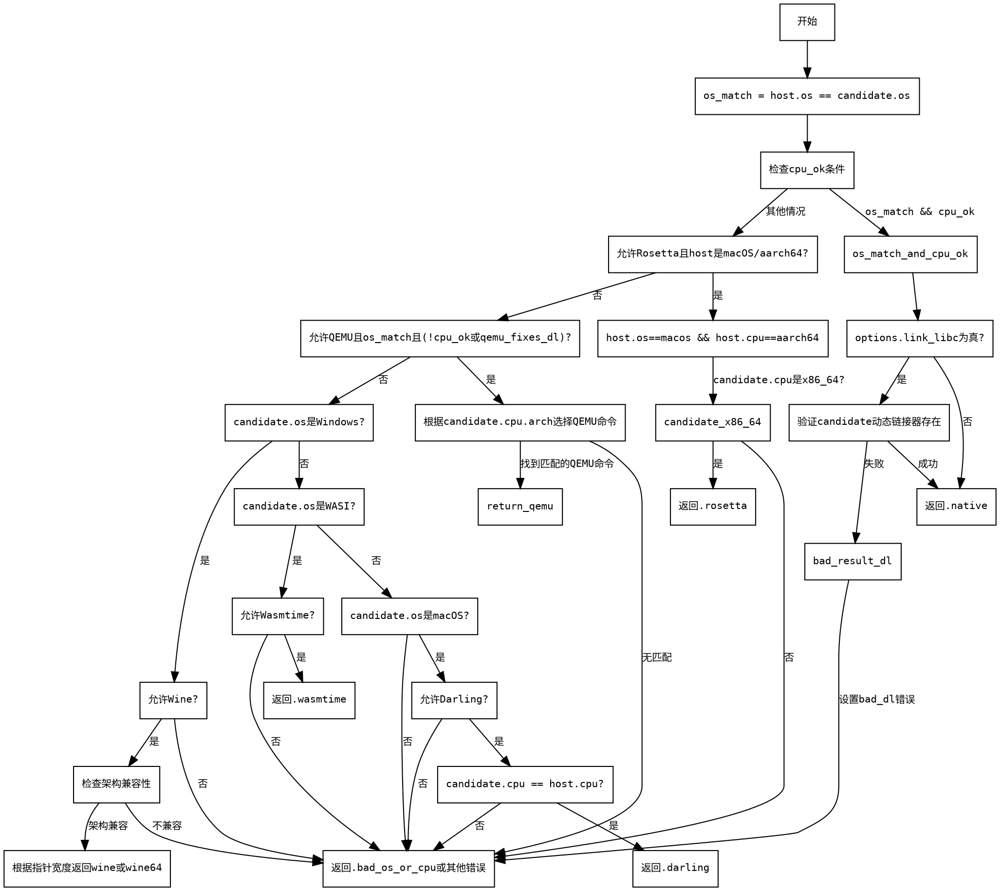

嗯，我需要为这个Zig函数`getExternalExecutor`生成一个流程图。首先，我得仔细阅读代码，理解它的逻辑结构。函数的主要目的是根据主机和目标平台的配置，选择合适的执行器（Executor），比如本地执行、QEMU、Rosetta、Wine等。

首先，函数开始检查操作系统是否匹配，以及CPU是否兼容。这里有多个条件判断，比如`os_match`和`cpu_ok`。接下来，如果OS和CPU都匹配，就检查是否需要链接libc，并验证动态链接器的存在。如果这些条件都满足，返回native执行器。

如果OS是macOS且CPU是aarch64，并且允许Rosetta，那么当目标架构是x86_64时，使用Rosetta。否则返回错误。

接下来是QEMU的条件判断，如果允许QEMU且OS匹配，但CPU不兼容或者需要QEMU修复动态链接器，就根据目标CPU架构返回对应的QEMU命令。

然后处理特定操作系统的情况，比如Windows使用Wine，WASI使用Wasmtime，macOS使用Darling。每个都有不同的条件和返回的执行器类型。

需要注意各个条件分支之间的逻辑关系，尤其是嵌套的if语句和switch结构。例如，在QEMU部分有一个大的switch语句，根据不同的CPU架构返回不同的QEMU命令。此外，不同的操作系统有不同的处理路径，比如Windows、WASI、macOS等。

在绘制流程图时，需要将这些条件分支清晰地表示出来，使用菱形判断节点，并根据不同的条件走向不同的处理分支。同时，要确保每个可能的返回路径都被覆盖，包括错误情况的返回，如`.bad_os_or_cpu`或其他错误类型。

可能需要注意的一些细节包括：

1. `cpu_ok`的多个条件判断，包括主架构兼容性（如x86_64与x86，aarch64与arm等）。
2. 动态链接器的检查仅在`link_libc`为true时进行。
3. Rosetta仅在macOS的特定条件下使用。
4. QEMU的条件允许在OS匹配但CPU不兼容或需要修复动态链接器时使用。
5. 不同操作系统的特殊处理（Windows、WASI、macOS）。

需要确保流程图中的每个判断节点都有明确的是/否分支，并且最终指向正确的执行器类型或错误结果。可能还需要处理一些特殊情况，比如QEMU中不同ABI的影响，或者Wine对32位和64位的区分。

最后，确保整个流程图的逻辑与代码一致，没有遗漏任何条件分支或返回路径。可能需要多次检查代码结构，确保每个条件都被正确转换为流程图中的节点和边。
================================================
