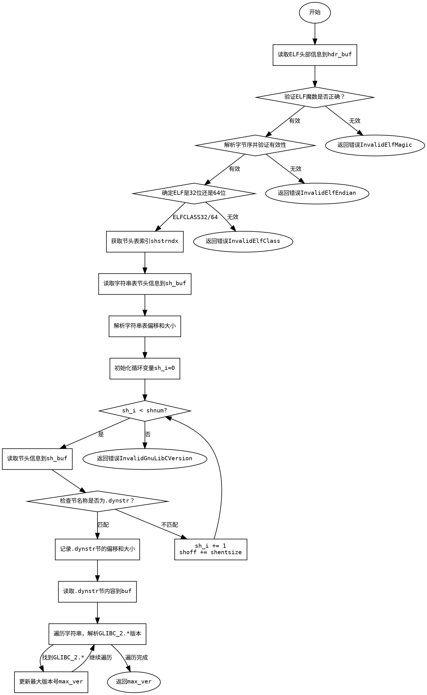

好，我现在需要分析用户提供的Zig代码，并生成相应的流程图。首先，我需要理解这个函数的功能和结构。这个函数名为glibcVerFromSoFile，它的作用是从一个ELF文件中提取GLIBC的版本信息。

首先，函数读取ELF文件的头部信息，验证ELF的魔数、字节序和版本。接着，确定ELF是32位还是64位，并获取节头表的偏移量。然后，找到.shstrndx对应的节头表项，读取字符串表的内容。之后，遍历所有的节头表项，寻找名为.dynstr的节，这个节包含动态链接的字符串信息。

找到.dynstr节后，函数会读取该节的内容，并遍历其中的所有字符串，寻找以“GLIBC_2.”开头的字符串，解析出对应的版本号，并记录最大的版本号作为结果返回。

接下来，我需要将这个过程转化为流程图。流程图应该包括主要的步骤和条件判断。需要注意各个步骤之间的顺序和可能的分支，例如验证ELF魔数失败时的错误返回，或者未找到.dynstr节时的错误处理。

可能的节点包括：
1. 读取ELF头部信息
2. 验证ELF魔数、字节序、版本
3. 确定ELF是32位还是64位
4. 获取节头表信息
5. 读取字符串表
6. 遍历节头表寻找.dynstr节
7. 读取.dynstr节内容
8. 遍历字符串，解析GLIBC版本
9. 返回最大版本或错误

在绘制流程图时，需要正确表示这些步骤之间的顺序，以及条件分支（如验证失败时返回错误）。同时，循环结构如遍历节头表项需要用合适的图形表示。

需要确保流程图符合Graphviz的语法，使用正确的节点和边连接，可能使用菱形表示条件判断，矩形表示处理步骤，椭圆形表示开始和结束点。

最后，检查是否有遗漏的步骤或错误的条件分支，确保流程图准确反映代码的逻辑流程。
================================================
