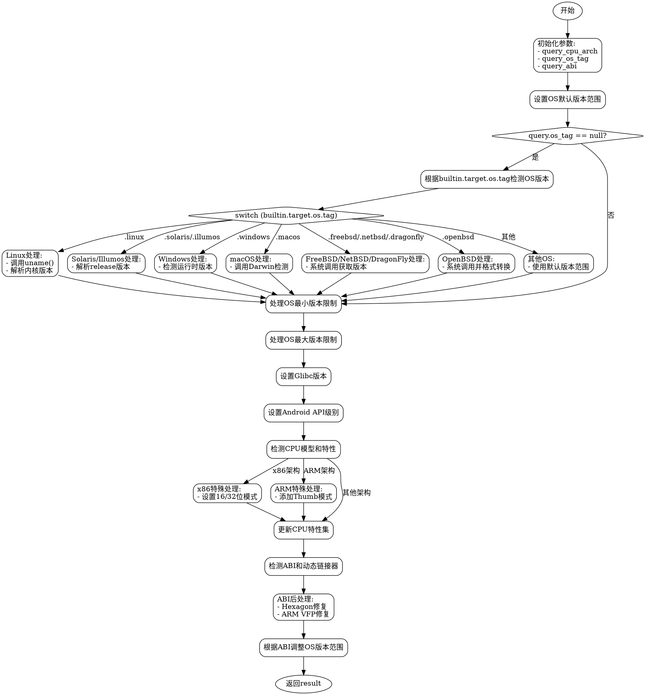

嗯，我需要用Graphviz来画这个Zig函数`resolveTargetQuery`的流程图。首先，我需要理解这个函数的结构和逻辑流程。

函数开头定义了几个变量：`query_cpu_arch`、`query_os_tag`和`query_abi`，它们分别从传入的查询参数或内置参数中获取值。接下来，根据操作系统类型（如Linux、Windows、macOS等），函数会进行不同的版本检测和处理。例如，对于Linux系统，它会通过`uname`获取内核版本，并尝试解析为语义化版本号。对于FreeBSD、NetBSD等，则通过系统调用来获取版本信息。

然后，函数处理操作系统版本的最小和最大限制，以及Glibc版本和Android API级别。接着是关于CPU架构的检测和特性设置，特别是针对x86、ARM等不同架构的特殊处理。之后，调用`detectAbiAndDynamicLinker`来检测ABI和动态链接器，并进行一些后续的CPU特性调整。

最后，函数确保检测到的ABI与查询的ABI一致，并根据需要调整操作系统版本范围。

在绘制流程图时，需要将这些步骤分解为节点，并用箭头表示流程的顺序。每个条件判断（如不同的操作系统分支）会形成分支结构。可能需要注意循环或递归结构，但在这个函数中主要是顺序和条件分支。

需要注意的是，Graphviz使用DOT语言，节点用方框表示，条件判断用菱形，流程步骤用矩形。每个条件分支需要明确标注条件，例如“OS是Linux？”、“是FreeBSD？”等。

可能需要将复杂的条件分支拆分为多个子图，以保持图表清晰。例如，处理不同操作系统的部分可以作为一个大的分支结构，每个操作系统对应一个子流程。

另外，函数中有多处错误处理（如`catch`），这些也需要在流程图中体现，可能作为不同的出口或处理节点。

最后，确保整个流程图的结构与代码逻辑一致，没有遗漏关键步骤，并且节点之间的连接正确。
================================================
