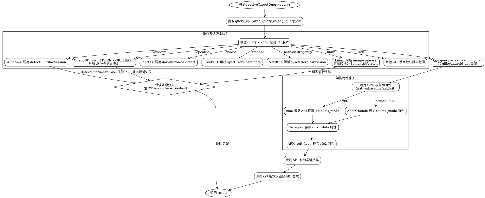

嗯，用户让我用Graphviz来画一个Zig函数的流程图。首先，我需要仔细看看这个函数的结构。这个函数叫做resolveTargetQuery，看起来是用来确定目标平台的配置，比如操作系统版本、CPU架构等等。

首先，我需要理清函数的主要步骤。函数开始处理Target.Query，然后根据不同的操作系统进行版本检测。比如，对于Linux，它会解析uname的输出来获取版本号；对于Windows，调用特定的检测函数；macOS则调用Darwin相关的检测方法。然后还有处理FreeBSD、NetBSD等其他系统的部分。

接下来，函数处理查询中的版本范围和ABI设置，调整CPU特性，比如x86的16位或32位模式，ARM的Thumb模式等。之后，检测ABI和动态链接器，并进行一些特定的CPU特性调整，比如Hexagon架构的小数据区问题，或者ARM的软浮点处理。

最后，确保ABI和操作系统版本的兼容性，如果检测到的ABI与查询的不一致，会根据需要调整操作系统版本范围。

现在要画流程图的话，需要把这些步骤分解成不同的节点，并用箭头表示流程走向。可能的结构是：

1. 开始节点：函数入口。
2. 处理操作系统版本检测，根据不同OS分支。
3. 处理查询中的版本范围和ABI设置。
4. CPU特性调整。
5. 检测ABI和动态链接器。
6. 特定CPU特性后处理。
7. 确保ABI和OS版本兼容性。
8. 返回结果。

不过，具体的流程可能更复杂，因为有多个条件分支，比如不同的操作系统类型，不同的CPU架构处理。可能需要为每个主要条件分支创建子图，比如Linux处理、Windows处理等。

另外，函数中有很多错误处理，比如解析版本号失败时的处理，这些也需要在流程图中体现出来，比如用条件判断节点，不同的错误路径。

可能需要使用不同的形状来表示不同的节点类型，比如菱形表示判断，矩形表示操作，椭圆形表示开始和结束。

不过，Graphviz的语法相对灵活，可以通过节点和边的定义来组织。需要注意的是，保持流程图的清晰，避免交叉太多，可能需要使用子图来分组不同的处理部分。

总之，我需要将函数的主要步骤和分支结构转化为Graphviz的节点和边，确保逻辑正确且易于理解。
================================================
