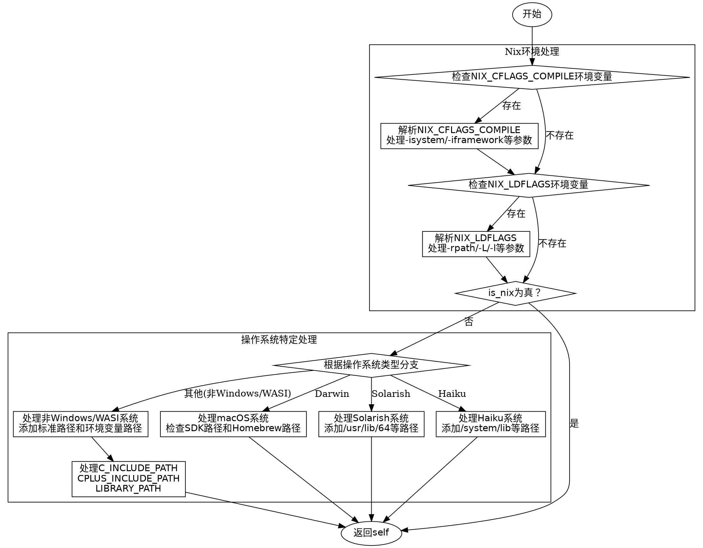

好的，我需要为这个Zig函数`detect`绘制流程图。首先，我需要仔细阅读并理解代码的结构和逻辑。

函数`detect`的主要任务是检测和设置本地路径，包括包含目录、库目录等。它首先处理Nix环境变量`NIX_CFLAGS_COMPILE`和`NIX_LDFLAGS`，然后根据不同的操作系统（如Darwin、Solarish、Haiku、非Windows/WASI系统）添加相应的路径。

流程图的起点是函数开始，然后检查是否存在Nix环境变量。如果存在，解析这些变量中的标志，处理`-isystem`、`-iframework`、`-rpath`等参数，并添加相应的路径或警告。处理完Nix环境后，如果检测到是Nix系统，直接返回结果。

如果不是Nix系统，接下来根据操作系统类型处理不同的路径。例如，对于Darwin（macOS），检查SDK是否安装，添加Homebrew的路径；对于Solarish、Haiku系统，添加特定的库和包含目录；对于非Windows/WASI系统（如Linux），处理各种标准路径和环境变量（如`C_INCLUDE_PATH`、`LIBRARY_PATH`）。

需要注意的是条件分支和循环结构，例如在解析环境变量时使用`while (true)`循环和`tokenizeScalar`来分割参数。同时，错误处理部分（如`else |err| switch (err)`）也需要在流程图中体现。

接下来，我需要将这些逻辑步骤转化为graphviz的流程图。每个判断节点用菱形表示，处理步骤用矩形，开始和结束用椭圆形。确保条件分支正确连接，流程清晰。

需要注意处理多个环境变量（NIX_CFLAGS_COMPILE和NIX_LDFLAGS）的解析，以及不同操作系统的路径处理。可能有些步骤是并行的，但流程图需要按顺序展开，避免交叉混乱。

最后，检查是否有遗漏的条件或步骤，确保流程图准确反映代码逻辑。
================================================
