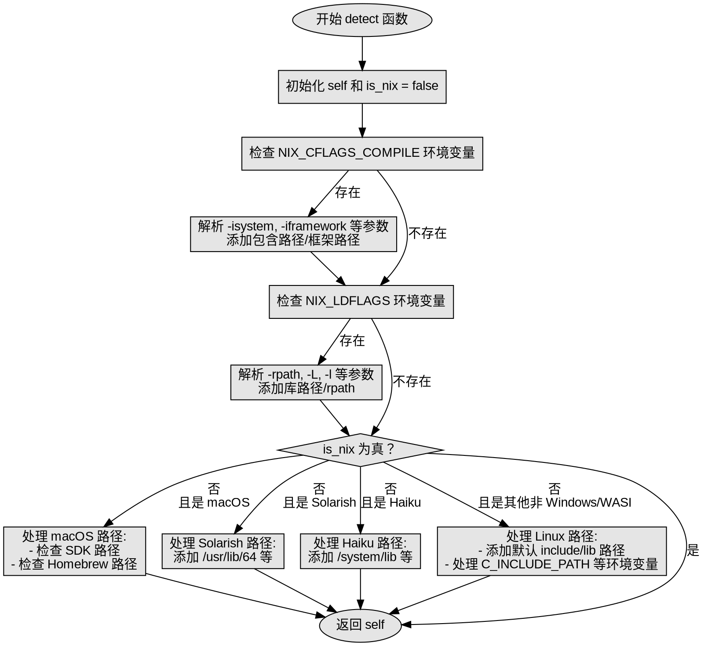

嗯，我现在需要为这个用Zig编写的`detect`函数绘制一个流程图。首先，我得仔细理解这个函数的结构和逻辑流程。让我先通读一下代码，看看它是如何工作的。

函数`detect`接受一个分配器和一个目标系统，返回`NativePaths`或错误。看起来它的主要作用是检测并收集本地系统的路径信息，比如包含目录、库目录等。首先处理Nix相关的环境变量`NIX_CFLAGS_COMPILE`和`NIX_LDFLAGS`，然后根据不同操作系统进行处理，比如Darwin（macOS）、Solarish、Haiku等。如果不是这些系统，则处理Linux等系统的情况，添加各种默认路径和环境变量中的路径。

流程图需要反映这些分支判断和处理步骤。可能的流程如下：

1. 函数开始，初始化`self`和`is_nix`标志。
2. 检查`NIX_CFLAGS_COMPILE`环境变量：
   - 如果存在，解析其中的参数（如`-isystem`, `-iframework`），添加对应的路径，处理可能的错误。
3. 检查`NIX_LDFLAGS`环境变量：
   - 解析参数（如`-rpath`, `-L`, `-l`），处理路径。
4. 如果检测到Nix环境变量（`is_nix`为真），直接返回结果。
5. 如果不是Nix，则根据操作系统类型处理：
   - Darwin（macOS）：
     - 检查SDK路径，添加相关目录。
     - 检查Homebrew路径。
   - Solarish系统：添加特定的lib和include目录。
   - Haiku系统：添加特定的lib目录。
   - 其他非Windows/WASI系统（如Linux）：
     - 添加默认的include和lib路径。
     - 处理`C_INCLUDE_PATH`、`CPLUS_INCLUDE_PATH`、`LIBRARY_PATH`环境变量。
6. 最后返回构造好的`self`。

需要注意各个条件分支之间的先后顺序，比如Nix环境变量处理优先，然后是不同操作系统的处理。特别是Darwin部分的处理，涉及SDK和Homebrew的判断。此外，对于非Nix的Linux系统，需要处理多个可能的路径和环境变量。

可能的遗漏点：比如，处理环境变量时的错误处理（如内存不足）、不同路径的拼接方式、以及某些条件判断的具体逻辑（如`isDarwin()`的判断是否准确）。

接下来，我需要将这些步骤转化为Graphviz的流程图结构。每个主要步骤作为一个节点，条件判断作为菱形判断节点，箭头表示流程方向。可能需要将大的条件分支拆分成子流程，以保持流程图的可读性。

例如：

- 开始节点
- 处理NIX_CFLAGS_COMPILE
- 处理NIX_LDFLAGS
- 判断is_nix是否为真，如果是，返回
- 否则，判断操作系统类型：
  - Darwin
  - Solarish
  - Haiku
  - 其他（Linux等）
- 每个操作系统对应的处理步骤
- 返回结果

在绘制时，需要注意循环结构，比如解析环境变量时的`while (true)`循环，但根据代码，这些循环在遇到`break`时会结束，所以可以简化为顺序处理每个token。

最后，确保所有可能的路径都被覆盖，没有遗漏的条件分支，并且错误处理流程正确表示（比如内存错误直接返回，而其他错误可能生成警告）。
================================================
