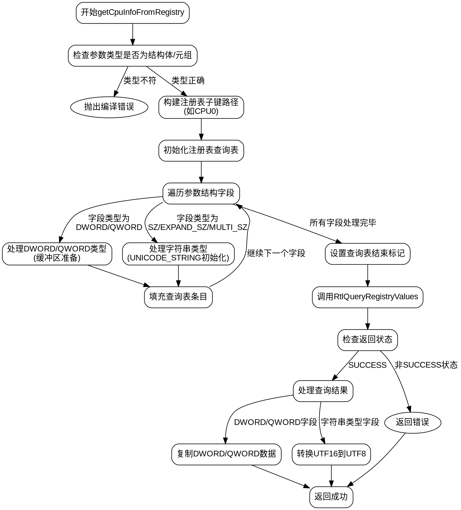

好的，我需要为这个Zig函数`getCpuInfoFromRegistry`绘制流程图。首先，我得仔细理解这个函数的结构和逻辑。

函数的主要目的是从Windows注册表中获取CPU信息。它接收一个核心编号（core）和一个参数结构（args），然后通过系统调用查询注册表数据。

首先，函数检查参数类型是否为结构体或元组，如果不是则抛出编译错误。接着，它构建了一个注册表查询表（RTL_QUERY_REGISTRY_TABLE），用于指定要查询的注册表项和值。然后，遍历参数结构中的每个字段，为每个字段创建相应的注册表查询条目，处理不同类型的数据（如字符串、DWORD、QWORD等）。最后，调用`RtlQueryRegistryValues`执行查询，并根据结果处理返回的数据。

流程图需要涵盖以下几个步骤：
1. 参数类型检查。
2. 构建注册表查询表的初始部分（子键查询）。
3. 遍历参数结构中的每个字段，填充查询表。
4. 设置查询表的结束标记（sentinel）。
5. 执行注册表查询系统调用。
6. 处理查询结果，包括不同类型的数据转换和复制。
7. 错误处理。

需要注意的是，在处理不同注册表数据类型时（如字符串、DWORD等），流程会有分支。此外，所有的内存缓冲区和类型转换需要正确表示。

可能遇到的难点是如何正确表示循环遍历字段和动态构建查询表。此外，错误处理部分（如系统调用返回非SUCCESS的情况）也需要在流程图中体现。

需要确保流程图中的每个步骤逻辑清晰，条件判断正确，并且涵盖所有可能的执行路径。同时，要注意Zig语言特有的特性，如编译时检查、内联循环等，在流程图中适当表示。
================================================
