嗯，我需要用Graphviz来画这个函数的流程图。首先，我得仔细看看这个函数的逻辑结构。函数名是detectIntelProcessor，参数包括cpu指针、family、model和brand_id。函数的主要逻辑是根据这些参数来设置cpu.model的值。

首先，函数开始检查brand_id是否为0，如果不是的话就直接返回。如果是0，那么继续根据family的值进行不同的处理。这里有一个switch语句，处理不同的family情况，比如3、4、5、6、15和其他情况。

对于family为6的情况，里面又有一个嵌套的switch，根据model的不同值来设置不同的cpu.model。这里有很多model的case，每个case对应不同的处理器型号。比如model是0x01的话，设置成pentiumpro，0x03、0x05、0x06设置成pentium2，等等。

然后是family为15的情况，这里又根据是否支持64位或SSE3来设置不同的模型。其他family的情况则直接返回，不处理。

接下来，我需要把这些逻辑转换成流程图的结构。流程图应该从函数入口开始，然后根据条件分支展开。每个条件判断对应一个菱形节点，处理不同的分支。每个分支最终指向设置cpu.model的节点，然后返回。

需要注意的是，family为6时，内部的switch结构有很多分支，可能需要单独展开。而其他family的处理相对简单。另外，每个case后面都有一个return，所以每个分支最终都会结束流程。

可能的结构是：开始 -> 检查brand_id是否为0？如果不是，结束。如果是，进入family的switch。每个family对应的处理分支，特别是family=6时，内部的model检查需要详细展开。然后每个分支处理完后返回。

需要确保所有的条件分支都被正确表示，并且流程图的节点和箭头清晰表达逻辑顺序。可能需要使用子图来组织family=6内部的复杂分支，避免主图过于混乱。

另外，要注意一些条件判断，比如family=5时检查是否有MMX特性，family=15时检查是否支持64bit或SSE3。这些也需要在流程图中体现为条件判断节点。

最后，生成的Graphviz代码需要正确使用节点和边，可能使用不同的形状（如菱形表示判断，矩形表示处理步骤），并合理排列，使流程图易于理解。
================================================

```dot
digraph flowchart {
    node [shape=rectangle fontname="Arial" style=filled fillcolor="#CCCCCC"];
    edge [fontname="Arial"];

    start [label="Start detectIntelProcessor(cpu, family, model, brand_id)"];
    check_brand_id [label="brand_id != 0?" shape=diamond];
    family_switch [label="switch (family)" shape=diamond];
    return_unknown [label="Return (Unknown)"];
    end [label="End"];

    start -> check_brand_id;
    check_brand_id -> family_switch [label="No"];
    check_brand_id -> end [label="Yes"];

    // Family 3
    family_3 [label="cpu.model = i386"];
    family_switch -> family_3 [label="family=3"];
    family_3 -> end;

    // Family 4
    family_4 [label="cpu.model = i486"];
    family_switch -> family_4 [label="family=4"];
    family_4 -> end;

    // Family 5
    family_5 [label="Has MMX?" shape=diamond];
    family_switch -> family_5 [label="family=5"];
    family_5_pentium_mmx [label="cpu.model = pentium_mmx"];
    family_5_pentium [label="cpu.model = pentium"];
    family_5 -> family_5_pentium_mmx [label="Yes"];
    family_5 -> family_5_pentium [label="No"];
    family_5_pentium_mmx -> end;
    family_5_pentium -> end;

    // Family 6
    subgraph cluster_family6 {
        label="Family=6";
        color=blue;
        
        model_switch [label="switch (model)" shape=diamond];
        model_default [label="Return (Unknown)"];
        
        // Example model cases (shortened for brevity)
        model_0x01 [label="cpu.model = pentiumpro"];
        model_0x03_05_06 [label="cpu.model = pentium2"];
        model_0x0f_16 [label="cpu.model = core2"];
        model_0x55 [label="Check AVX512BF16/AVX512VNNI" shape=diamond];
        model_0x55_cooperlake [label="cpu.model = cooperlake"];
        model_0x55_cascadelake [label="cpu.model = cascadelake"];
        model_0x55_default [label="cpu.model = skylake_avx512"];
        
        model_switch -> model_0x01 [label="0x01"];
        model_switch -> model_0x03_05_06 [label="0x03/0x05/0x06"];
        model_switch -> model_0x0f_16 [label="0x0f/0x16"];
        model_switch -> model_0x55 [label="0x55"];
        model_switch -> model_default [label="..."];
        
        model_0x55 -> model_0x55_cooperlake [label="AVX512BF16"];
        model_0x55 -> model_0x55_cascadelake [label="AVX512VNNI"];
        model_0x55 -> model_0x55_default [label="Else"];
    }
    
    family_switch -> model_switch [label="family=6"];
    model_0x01 -> end;
    model_0x03_05_06 -> end;
    model_0x0f_16 -> end;
    model_0x55_cooperlake -> end;
    model_0x55_cascadelake -> end;
    model_0x55_default -> end;
    model_default -> end;

    // Family 15
    family_15 [label="Has 64bit?" shape=diamond];
    family_15_nocona [label="cpu.model = nocona"];
    family_15_sse3 [label="Has SSE3?" shape=diamond];
    family_15_prescott [label="cpu.model = prescott"];
    family_15_p4 [label="cpu.model = pentium4"];
    
    family_switch -> family_15 [label="family=15"];
    family_15 -> family_15_nocona [label="Yes"];
    family_15 -> family_15_sse3 [label="No"];
    family_15_sse3 -> family_15_prescott [label="Yes"];
    family_15_sse3 -> family_15_p4 [label="No"];
    family_15_nocona -> end;
    family_15_prescott -> end;
    family_15_p4 -> end;

    // Default case
    family_switch -> return_unknown [label="Else"];
    return_unknown -> end;
}
```
