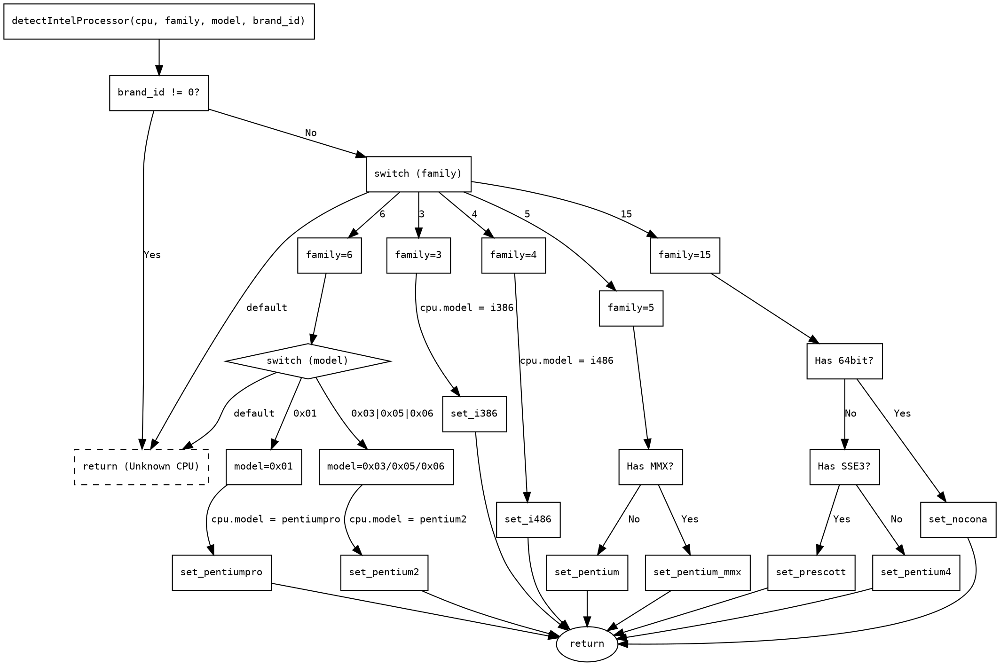

好的，我需要帮助用户将提供的Zig代码中的函数转换为Graphviz流程图。首先，我需要仔细阅读并理解这段代码的结构。

函数名为detectIntelProcessor，接收cpu指针、family、model、brand_id参数。首先检查brand_id是否为0，如果不是，直接返回。接下来根据family的值进行switch判断：

- 当family为3、4、5、6、15时，分别处理。
- 特别是family为6时，内部还有多层model的switch判断，对应不同的CPU型号。
- 其他family情况直接返回。

对于每个case，函数设置cpu.model并返回。需要注意的是，family=6时，model有很多不同的情况，每个case对应不同的CPU模型。而family=15时，根据是否支持64位或SSE3来选择不同的模型。

接下来，我需要将这些逻辑转换为流程图。流程图的开始是函数入口，然后检查brand_id是否为0，不是的话直接结束。如果是0，进入family的switch分支。

每个family分支下可能还有子判断，比如family=6时根据model的值进一步分支，family=15时根据featureSetHas判断。每个条件判断后指向对应的设置cpu.model的步骤，然后返回。

需要注意流程图的层级结构，特别是嵌套的switch和条件判断。使用Graphviz的节点和箭头表示判断和流程走向。可能需要使用子图来组织family=6中的复杂model判断，或者用不同的颜色区分不同层级的判断。

需要确保所有可能的路径都被覆盖，特别是每个case后的return语句，避免流程错误连接。另外，处理else情况时，要明确标注未知CPU模型的分支。

最后，生成Graphviz的DOT代码，正确嵌套节点和边，确保结构清晰，可读性强。
================================================


将此DOT代码保存为`.gv`文件后，可以用Graphviz工具生成流程图。流程图包含：

1. 函数入口
2. 对`brand_id`的初始检查
3. 按`family`分发的switch结构
4. 每个`family`分支内的详细逻辑（如`family=6`包含多层model判断）
5. 支持特性检查（如MMX/64bit/SSE3）
6. 未知CPU型号的统一返回节点

提示：实际使用时需要安装Graphviz工具链，执行命令：
```bash
dot -Tpng flowchart.gv -o flowchart.png
```