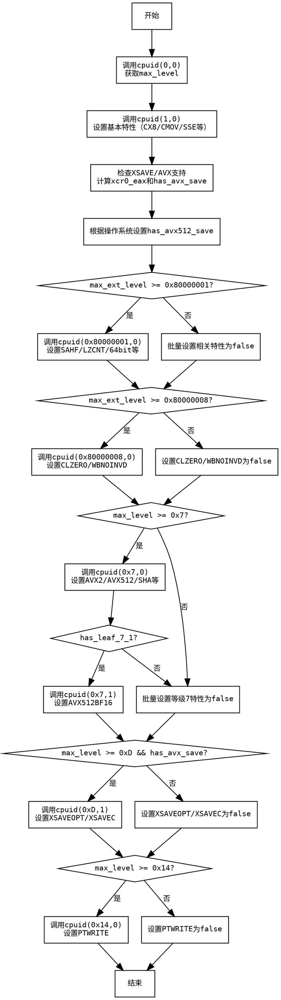

嗯，我现在需要帮用户用Graphviz画出一个Zig函数的流程图。这个函数是detectNativeFeatures，看起来是用来检测x86 CPU的功能的。首先，我得理解这个函数的结构和逻辑流程，然后才能转换成流程图。

首先，函数开始调用了cpuid(0, 0)，获取max_level。然后调用cpuid(1, 0)，设置一些基本的CPU特性，比如cx8、cmov、sse等。接着处理是否有xsave和avx，然后根据操作系统是否是Darwin来决定has_avx512_save的值。之后，设置avx、fma等特性。

接下来是处理扩展级别的部分，比如0x80000001，检查是否有64位支持，设置sahf、lzcnt等。然后是0x80000008处理内存相关的特性，比如clzero。之后是处理等级7的cpuid，设置更多的特性，如avx2、avx512系列等。还有处理0xD和0x14等级的部分。

我需要把这些步骤分解成不同的块，比如初始的cpuid调用，各个条件分支（如if max_ext_level >= 0x80000001等），以及每个条件块内部的设置。然后，确定各个块之间的流程，比如顺序执行、条件判断后的分支等。

可能的流程是：开始 -> 初始cpuid -> 设置基本特性 -> 处理avx和xcr0 -> 处理扩展级别 -> 处理0x80000001 -> 处理0x80000008 -> 处理等级7 -> 处理等级D -> 处理等级14 -> 结束。

需要注意条件判断的分支，例如当max_ext_level不满足时，需要设置某些特性为false。此外，有些特性设置依赖于之前的变量，比如has_avx_save，这会影响后续的设置。

接下来，我需要将这些步骤转化为Graphviz的节点和边。每个主要步骤作为一个节点，条件判断作为菱形节点，然后根据条件的结果连接不同的分支。例如，if (max_ext_level >= 0x80000001) 是一个条件节点，分为“是”和“否”两个分支，分别处理对应的代码块。

可能的结构：

1. 开始节点：调用cpuid(0,0)和cpuid(1,0)，设置基本特性。
2. 处理avx和xcr0，设置has_avx_save和has_avx512_save。
3. 处理0x80000000的扩展级别，检查max_ext_level。
   - 如果满足，进入处理0x80000001的部分，设置相关特性。
   - 否则，设置对应的特性为false。
4. 类似地处理其他cpuid等级，如0x80000008、7、D、14等。
5. 结束节点。

每个条件判断需要两个分支，可能有些嵌套的条件，比如在等级7的处理中还有子条件（比如has_leaf_7_1）。

需要注意的是，Graphviz的流程图可能会比较复杂，特别是当有很多嵌套条件时。可能需要将每个主要条件判断作为分支点，并用子图来组织相关的处理步骤。

另外，代码中有多个循环设置特性为false的情况，比如在else块中循环遍历一个特性列表。在流程图中，这些可以表示为“设置特性X为false”的节点，可能合并为一个节点表示批量设置。

最后，确保流程图的箭头正确连接各个步骤，包括条件分支后的路径，以及顺序执行的步骤。
================================================
以下是使用Graphviz绘制的`detectNativeFeatures`函数流程图：

### 流程图说明：
1. **层级结构**：从初始的CPUID调用开始，逐步检查扩展级别和特性支持。
2. **条件分支**：用菱形节点表示条件判断（如`max_ext_level >= 0x80000001?`），并根据结果跳转到不同分支。
3. **批量设置**：对于不满足条件的情况（如`else`块），用单个节点表示批量设置特性为`false`。
4. **嵌套逻辑**：主级别7的处理包含子条件`has_leaf_7_1`，用于进一步检测AVX512BF16支持。
5. **最终汇聚**：所有分支最终汇聚到结束节点。

可以通过[Graphviz在线工具](https://dreampuf.github.io/GraphvizOnline)粘贴此代码生成流程图。