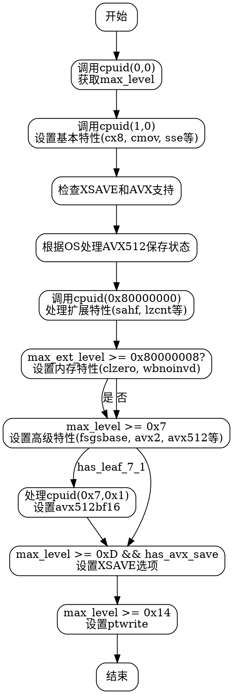

好的，我需要为提供的Zig函数`detectNativeFeatures`绘制一个流程图。首先，我需要理解这个函数的结构和逻辑流程。函数的主要目的是检测CPU的特性，并根据不同的条件设置相应的特性标志。

首先，函数开始调用`cpuid(0, 0)`获取基本的CPU信息，然后根据返回的`max_level`值进行不同的处理。接下来，处理`cpuid(1, 0)`的结果，设置一系列的基本特性如`.cx8`, `.cmov`等。然后检查是否有XSAVE和AVX支持，并根据操作系统是否为Darwin来处理AVX512的保存状态。

之后，函数处理扩展的CPUID信息（`0x80000000`），设置如`.sahf`, `.lzcnt`等特性。接着，处理`0x80000008`的CPUID来设置内存相关特性，如`.clzero`和`.wbnoinvd`。

当`max_level >= 0x7`时，处理更多的CPUID叶子，设置如`.fsgsbase`, `.avx2`, `.avx512f`等高级特性。这里还包含对`cpuid(0x7, 0x1)`的处理以检测`.avx512bf16`。

接下来，处理`0xD`叶子来设置XSAVE相关特性，以及`0x14`叶子设置`.ptwrite`。

在绘制流程图时，需要注意各个条件分支，比如`if (max_ext_level >= 0x80000001)`和`if (max_level >= 0x7)`等，这些条件会导致不同的处理路径。同时，需要注意循环结构，例如当某些条件不满足时，使用循环将多个特性设置为false。

最后，需要确保流程图的节点和箭头正确反映函数的执行顺序和条件分支，使用Graphviz的语法来表示这些结构，避免使用Mermaid。
================================================


该流程图使用Graphviz的DOT语言绘制，主要特点包括：

1. 使用菱形节点表示条件判断
2. 矩形节点表示具体操作步骤
3. 箭头方向表示程序执行流程
4. 关键CPUID检查点用条件分支表示
5. 保持了代码中处理不同CPU特性层级的顺序
6. 突出了AVX512和XSAVE相关特性的特殊处理逻辑
7. 包含了从基本特性检测到扩展特性检测的完整流程

可以使用Graphviz工具（如dot命令）将其渲染为PNG/SVG等格式：
```bash
dot -Tpng flowchart.dot -o flowchart.png
```