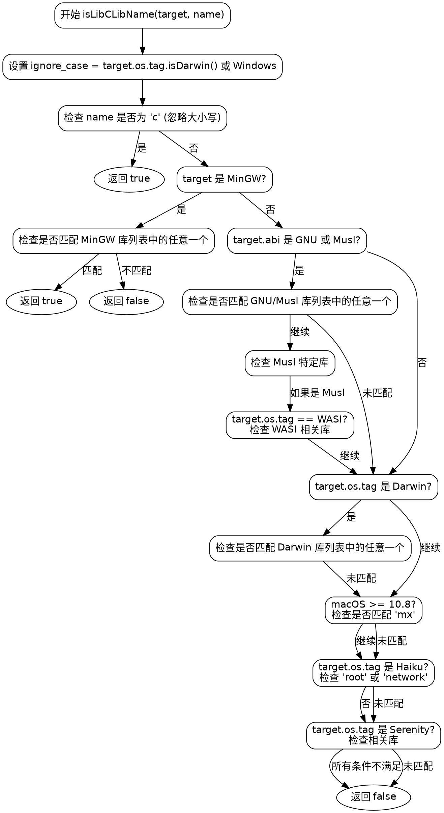

好的，我需要为给定的Zig函数生成一个流程图。首先，我需要理解这个函数的结构和逻辑流程。函数名为isLibCLibName，接受target和name参数，返回布尔值。主要逻辑是根据不同的操作系统和目标环境检查name是否属于特定的库名列表。

首先，函数开始处设置ignore_case变量，基于目标操作系统是否为Darwin或Windows。然后检查name是否为"c"（忽略大小写），如果是则返回true。

接下来，如果目标是MinGW环境，会有一系列的条件检查，如果匹配其中一个库名则返回true，否则返回false。这部分有很多if语句，每个都检查不同的库名。

如果目标不是MinGW，但ABI是GNU或Musl，则会检查另一组库名，如"m"、"rt"、"pthread"等。对于Musl，还有额外的库名检查，特别是当目标OS是WASI时，有特定的WASI相关库名。

然后，针对Darwin系统（macOS），检查一组不同的库名，如"System"、"dbm"、"dl"等。此外，如果macOS版本至少是10.8，还会检查"mx"库。

接着是Haiku和Serenity操作系统的特定库名检查。

最后，如果所有条件都不满足，返回false。

在绘制流程图时，需要注意各个条件分支的结构，尤其是MinGW部分的大量并列条件。可能需要将这些条件合并为一个判断块，表示检查多个可能的库名。其他部分则根据不同的OS和ABI分支处理。流程图应反映函数的分支结构，确保每个条件路径正确连接，直到最终返回结果。
================================================

该流程图使用Graphviz的DOT语言绘制，展示了函数的主要逻辑分支。每个条件判断用菱形节点表示，操作步骤用矩形节点，返回结果用椭圆节点。流程从顶部开始，按代码逻辑依次检查不同的目标环境和库名匹配条件，最终返回结果。