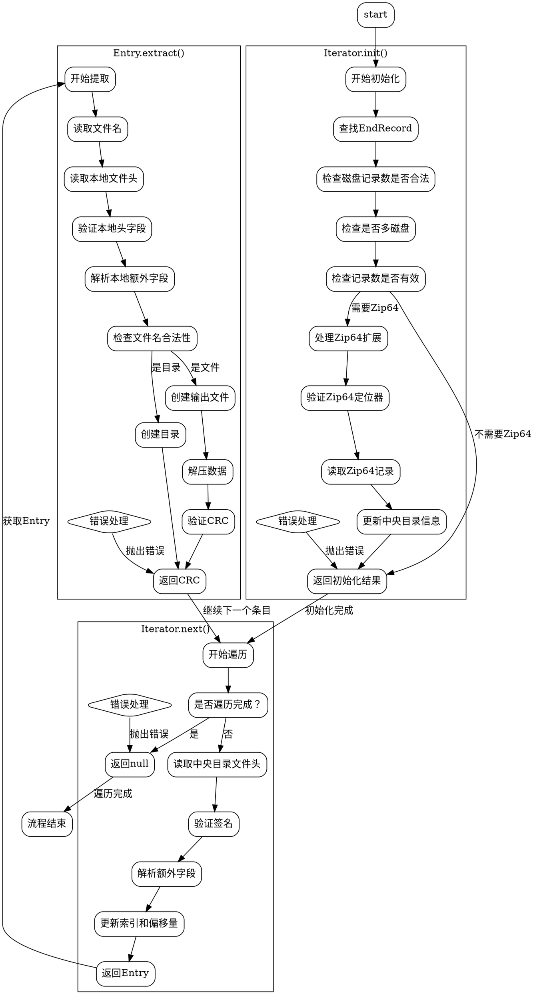

嗯，我现在需要为这个用Zig编写的ZIP文件处理函数画一个流程图。首先，我需要理解这段代码的结构和逻辑。看起来这个函数定义了一个迭代器，用于遍历ZIP文件中的条目。迭代器的初始化函数`init`负责找到ZIP文件的结束记录，并处理可能的Zip64扩展。`next`方法用于逐个读取中央目录中的条目，而`Entry`结构体的`extract`方法负责提取单个文件。

首先，我应该从`init`函数开始。它接收一个`SeekableStream`，然后找到结束记录（EndRecord）。这里可能需要处理错误情况，比如多磁盘的ZIP文件不被支持，或者记录数不一致等。之后，如果有Zip64扩展，需要进一步读取EndLocator64和EndRecord64来获取正确的信息。

接下来是`next`函数，它在中央目录中逐个读取条目。每个条目需要检查签名是否正确，处理可能的额外字段（如Zip64信息），然后构造并返回一个`Entry`结构体。

然后是`Entry`的`extract`方法，这部分比较复杂。它需要定位到本地文件头，验证各种字段的一致性，处理可能的Zip64扩展，解压数据，并写入到目标目录。这里需要注意文件名处理、目录创建、解压方法的选择以及CRC校验等。

在绘制流程图时，可能需要将整个过程分为几个主要部分：初始化、迭代条目、提取条目。每个部分需要详细展示步骤、条件判断和错误处理。例如，初始化阶段需要处理EndRecord和可能的Zip64信息；迭代阶段需要遍历中央目录，处理每个条目的元数据；提取阶段则需要处理文件头、解压数据，并处理文件名和目录结构。

需要注意的是，代码中有很多错误检查，比如检查签名是否匹配、字段是否一致等，这些都需要在流程图中体现为条件分支。此外，Zip64的支持涉及到多个条件判断和字段覆盖，这部分逻辑也需要清晰地展示出来。

可能遇到的挑战是如何将复杂的逻辑简化成清晰的流程图节点，尤其是错误处理和多条件分支。需要确保每个判断点都有明确的是/否分支，并且流程图的走向符合代码的执行顺序。同时，不同函数之间的调用关系（如`init`、`next`、`extract`）也需要在图中有所体现，可能通过子流程或不同的模块来表示。

总结一下，流程图的绘制需要涵盖以下几个主要步骤：
1. 初始化迭代器，处理EndRecord和Zip64扩展。
2. 遍历中央目录，逐个读取条目信息。
3. 对每个条目进行提取，包括读取本地文件头、处理额外字段、解压数据，并写入文件。

在绘制过程中，要特别注意错误处理的路径，确保每个可能的错误情况都有对应的流程分支。此外，代码中的循环结构（如处理额外字段的循环）也需要在流程图中正确表示。
================================================
