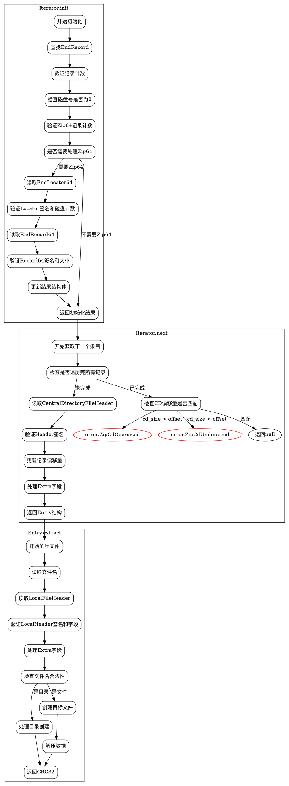

嗯，我需要为提供的Zig代码生成一个Graphviz的流程图。首先，我要理解这段代码的结构。看起来这是一个用于处理ZIP文件的迭代器实现，包含了初始化（init）和下一个条目（next）的方法，以及Entry结构体的extract方法。

首先，我应该确定主要的函数和它们之间的关系。pub fn Iterator返回一个结构体，其中包含init和next方法。Entry结构体还有extract方法。流程图需要展示这些函数之间的调用流程以及可能的错误处理。

接下来，我需要考虑每个函数的执行步骤。例如，init函数会查找ZIP的结束记录，处理可能的Zip64扩展，并进行各种验证。next方法遍历中央目录记录，读取每个条目的信息，处理扩展字段等。extract方法则负责解压文件，处理本地文件头，验证数据，并写入目标目录。

然后，我需要将这些步骤分解成流程图中的节点和判断条件。例如，在init中，是否有Zip64的需要处理？在next中，是否还有更多的记录？在extract中，文件名是否合法，是否是目录等。每个判断条件会导致不同的流程分支。

还要注意错误处理的情况，比如返回error.ZipMultiDiskUnsupported或error.ZipTruncated等，这些应该在流程图中作为不同的出口节点。

可能遇到的挑战是如何将复杂的逻辑分支简洁地表示出来，尤其是嵌套的条件和循环。需要确保每个判断点清晰，流程图的箭头正确指向相应的处理步骤或错误出口。

最后，使用Graphviz的DOT语言来组织这些节点和边，确保结构正确，可读性强。可能需要将大的函数拆分成多个子图，或者使用群集来分组相关的步骤。

总结步骤：
1. 确定主要函数和子函数。
2. 分解每个函数的步骤和条件判断。
3. 绘制每个函数的流程图，包含开始、处理步骤、判断节点、错误处理。
4. 使用Graphviz语法将这些元素连接起来，确保逻辑正确。
================================================

这个流程图使用Graphviz的DOT语言绘制，包含三个主要子图：
1. **Iterator.init**：处理ZIP文件初始化逻辑，包括Zip64扩展的检测。
2. **Iterator.next**：遍历中央目录条目并验证数据。
3. **Entry.extract**：解压单个文件并处理目录结构。

每个子图通过逻辑箭头连接，错误节点用红色椭圆形表示。关键步骤包括签名验证、字段检查、Zip64处理、文件名验证和数据解压。