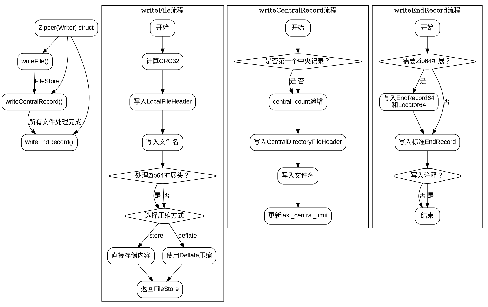

嗯，用户给了一个Zig语言的代码片段，属于一个ZIP压缩库的一部分。用户希望用Graphviz画出这个函数的流程图。首先，我需要理解这段代码的结构和各个函数的作用，然后才能正确绘制流程图。

首先，代码定义了一个泛型结构体Zipper，它接收一个Writer类型作为参数。这个结构体有四个字段：counting_writer、central_count、first_central_offset和last_central_limit。结构体内部有三个主要的方法：writeFile、writeCentralRecord和writeEndRecord。

1. **writeFile方法**：负责将文件内容写入到ZIP中。流程可能包括计算CRC32校验和，写入本地文件头信息，处理可能的压缩（如存储或deflate），最后返回文件存储的信息。

2. **writeCentralRecord方法**：用于写入中央目录记录，记录每个文件的元数据，如压缩方法、大小、偏移等。

3. **writeEndRecord方法**：写入ZIP文件的结束记录，包括中央目录的元数据汇总，可能处理ZIP64扩展。

接下来，我需要确定如何将这些方法转换为流程图。每个方法内部的逻辑分支需要被分解成不同的节点。例如，在writeFile中，根据是否使用压缩方法（store或deflate）会有不同的处理步骤。此外，处理header_options中的zip64选项也是一个分支点。

可能的挑战包括：
- 正确识别每个条件判断和循环结构。
- 处理泛型结构体和类型参数，这在流程图中可能需要简化表示。
- 确保不同方法之间的调用关系清晰，例如writeFile返回的FileStore如何被writeCentralRecord使用。

我需要确保流程图中的每个节点代表一个操作或判断，边代表控制流。例如，在writeFile中，流程可能开始于计算CRC32，然后写入头信息，处理文件名，检查header_options是否存在，处理zip64扩展，根据压缩方法选择不同的路径，最后返回结果。

对于writeCentralRecord，流程可能包括检查是否是第一个中央记录，更新计数器，构建并写入中央目录头信息，记录偏移。

对于writeEndRecord，需要处理ZIP64的情况，写入相应的结束记录和定位器，最后写入标准的结束记录和可能的注释。

最后，需要将这些方法整合到一个整体的流程图中，展示从创建Zipper实例到写入文件、中央记录和结束记录的完整过程。可能需要使用子图来区分不同的方法，保持图表的结构清晰。
================================================

这个流程图：
1. 使用子图分别表示三个核心方法的主要流程
2. 使用菱形节点表示条件分支（如压缩方式选择、Zip64判断）
3. 用箭头标注关键数据传递（如FileStore对象）
4. 保持ZIP规范的核心步骤：写入本地文件头 -> 中央目录记录 -> 结束记录
5. 用不同颜色区域区分不同方法的逻辑块（实际渲染时需配置样式）