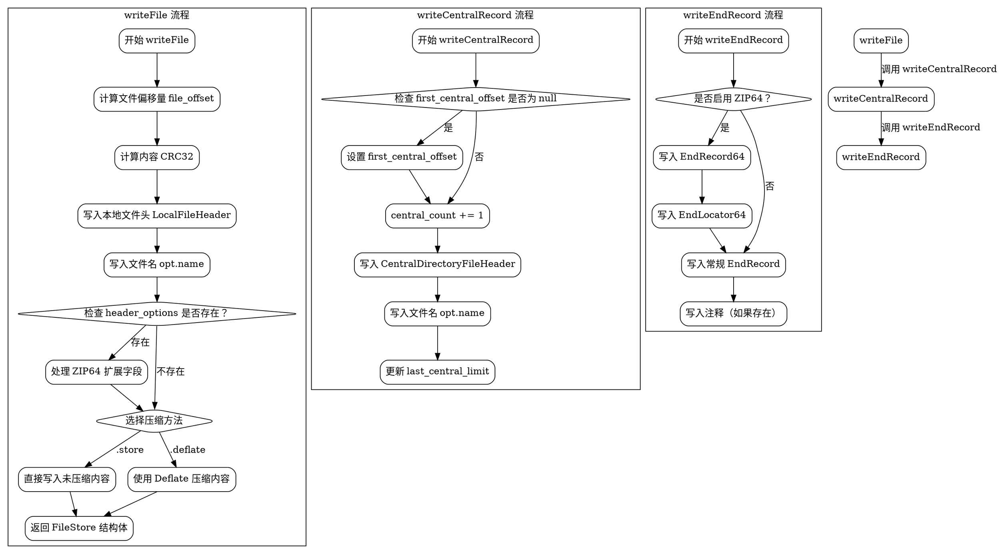

好的，我现在需要帮用户用Graphviz画出他们提供的Zig代码的流程图。首先，我得仔细看一下这段代码的结构和各个函数的作用。

首先，代码定义了一个泛型结构体Zipper，它接收一个Writer类型参数。结构体内部有几个字段：counting_writer、central_count、first_central_offset和last_central_limit。然后有三个主要的方法：writeFile、writeCentralRecord和writeEndRecord。

我需要为这三个方法分别绘制流程图，同时考虑到它们之间的调用关系和数据流动。比如，writeFile可能会影响counting_writer的状态，而writeCentralRecord和writeEndRecord可能依赖于之前写入的数据。

首先处理writeFile函数。这个函数负责写入文件的本地头信息、文件名、内容，并根据压缩方法处理内容。这里有几个条件分支，比如是否使用header_options中的zip64选项，以及不同的压缩方法（store和deflate）。这些都需要在流程图中用判断节点表示。

接下来是writeCentralRecord函数，它负责写入中央目录记录。这里有一个条件判断，检查是否是第一个中央记录，从而设置first_central_offset。同时，更新central_count和last_central_limit。这个函数的结构相对简单，但需要连接到之前的writeFile操作。

最后是writeEndRecord，处理结束记录，包括可能的Zip64扩展和常规的结束记录。这里有很多条件判断，比如是否提供zip64选项，以及各个字段的默认值处理。这些条件分支需要详细体现在流程图中。

需要注意的是，Graphviz使用的是DOT语言，所以需要正确使用节点和边的语法。每个函数作为一个子图，函数内部的步骤作为节点，条件判断用菱形节点，箭头表示流程方向。

可能会遇到的问题包括正确识别各个条件分支，确保所有可能的路径都被覆盖，以及保持图表的结构清晰，避免交叉过多导致难以阅读。此外，各个函数之间的调用顺序和数据依赖也需要在图中有所体现，可能需要通过不同的颜色或注释来区分。

在开始编写Graphviz代码之前，最好先草拟每个函数的流程图，确定节点和边的逻辑顺序。然后，将这些子图整合到主图中，确保整体结构合理。最后，检查是否有遗漏的条件或步骤，并进行必要的调整。
================================================
