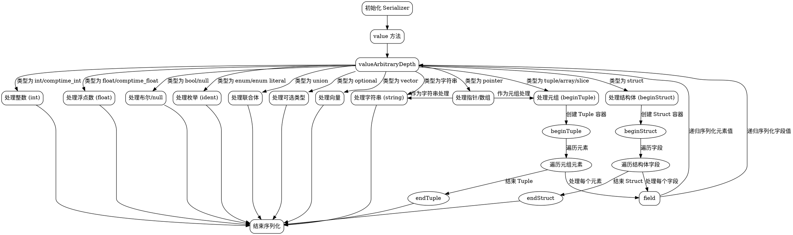

嗯，我现在需要根据提供的Zig代码文件`zon/stringify.zig`来绘制一个流程图。首先，我需要理解这个代码的功能。看起来这是一个序列化库，用于将Zig的数据结构转换为ZON（Zig Object Notation）格式。主要结构是一个`Serializer`结构体，它包含各种方法来处理不同类型的数据，如整数、浮点数、布尔值、字符串、结构体、元组等。

首先，我需要确定流程图的入口点。通常，流程图的起点是初始化函数。在代码中，`init`函数用于初始化`Serializer`，所以这可能是一个起点。接下来，`value`方法似乎是处理不同类型数据的分发点，根据不同的类型调用不同的序列化方法，比如`int`、`float`、`string`等。

然后，我需要考虑各个方法之间的调用关系。例如，`valueArbitraryDepth`方法根据类型信息(`@typeInfo`)选择不同的处理路径。例如，处理整数时调用`int`方法，处理结构体时可能调用`beginStruct`和相关的字段处理方法。此外，还有一些辅助方法如`indent`、`newline`等用于格式化输出。

接下来，我需要识别循环和条件分支。例如，在处理数组或切片时，会遍历元素并递归调用序列化方法。结构体和元组的处理涉及到多个字段的迭代，这也可能形成循环结构。此外，`switch`语句根据不同的类型信息分支到不同的处理逻辑，这需要在流程图中用条件节点表示。

我还需要注意错误处理。代码中有很多`try`语句，处理可能的写入错误。这些错误处理流程是否需要在流程图中体现？根据用户的需求，可能需要简化错误处理，只关注主要流程。

另外，`beginStruct`和`beginTuple`方法返回`Struct`和`Tuple`类型，这些类型内部也有自己的方法如`field`和`end`。这些子流程需要作为子图来处理，或者作为主流程的一部分。

现在，我需要将这些逻辑转化为流程图元素：

1. **节点**：表示函数或方法，如`init`、`value`、`int`、`float`、`string`、`beginStruct`、`beginTuple`等。
2. **条件分支**：基于数据类型（如`switch`语句中的不同`@typeInfo`情况）。
3. **循环**：如遍历数组、结构体字段等。
4. **流程连接**：显示方法之间的调用顺序。

可能的挑战是如何简洁地表示复杂的类型分发和递归调用。例如，处理结构体时可能需要递归处理每个字段，这可能导致流程图的深度增加。需要找到一种平衡，使流程图既详细又不至于过于复杂。

另外，代码中有许多方法处理不同的数据类型，可能需要为每种主要数据类型（如整数、字符串、结构体等）创建单独的处理分支，并在主流程中分派到这些分支。

最后，需要确定流程图的结束点，通常是序列化完成，写入最终的闭合符号（如`}`）并结束。

总结步骤：
1. 从`init`开始。
2. 调用`value`方法。
3. 根据数据类型分派到相应的处理方法（如`int`、`float`等）。
4. 处理复合类型（结构体、元组）时，进入子流程，处理每个字段。
5. 递归处理嵌套的数据结构。
6. 完成序列化后结束。

需要注意处理格式化（缩进、换行）的部分，但可能在流程图中简化为辅助步骤。

现在，我需要将这些思考转化为Graphviz的DOT语言，用节点和边表示流程。
================================================

该流程图展示了以下逻辑：
1. 从初始化开始，进入`value`方法
2. 根据数据类型分派到对应的处理分支（int/float/struct/tuple等）
3. 复杂类型（struct/tuple）会创建容器并递归处理子元素
4. 最终收敛到结束节点
5. 使用椭圆节点表示容器生命周期控制点
6. 箭头上的标签说明了条件判断逻辑