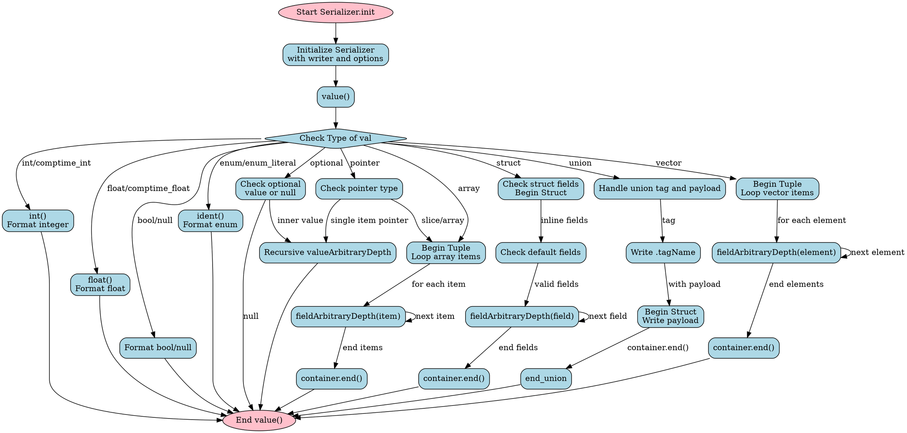

好的，我现在需要为提供的Zig代码生成一个流程图。首先，我需要理解这段代码的功能。看起来这是一个用于序列化的模块，主要结构是`Serializer`，它处理不同类型的数据并将其转换为特定格式的字符串。代码中包含了处理整数、浮点数、布尔值、结构体、元组、联合体等不同类型的序列化方法。

接下来，我需要确定如何将这段代码转换为流程图。流程图通常展示函数之间的调用关系、条件判断和循环结构。由于代码较长且包含多个方法，我需要识别主要的流程节点，例如初始化、处理不同类型数据的分支、递归处理结构体或元组等。

首先，`Serializer`结构体的`init`方法用于初始化。然后是`value`方法，它根据传入的数据类型调用不同的处理函数，比如`int`、`float`、`bool`等。在处理结构体或元组时，会调用`beginStruct`或`beginTuple`，并遍历字段进行序列化。此外，处理可选类型、联合类型等也有不同的逻辑分支。

需要注意递归处理的情况，例如在处理结构体字段时可能会再次调用`valueArbitraryDepth`。同时，代码中使用了Zig语言的特性，如`comptime`进行编译时检查，这在流程图中可能需要特别标注。

在绘制流程图时，应从`Serializer.init`开始，然后展示调用`value`方法后的不同类型处理分支。每个分支可能有不同的处理步骤，如调用`int`、`float`或进入结构体/元组的处理流程。结构体和元组的处理会涉及循环遍历字段，并可能递归调用自身。

此外，错误处理部分（如`Writer.Error`）也需要在流程图中体现，但可能作为终止节点或分支处理。

最后，需要确保流程图不使用Mermaid语法，而是符合Graphviz的DOT语言格式。需要定义节点、箭头来表示流程走向，条件判断使用菱形节点，处理步骤使用矩形节点，开始和结束使用椭圆节点。

总结步骤：
1. 确定入口点（`Serializer.init`）。
2. 展示`value`方法的分支处理。
3. 展开结构体、元组等复合类型的处理流程。
4. 处理递归和循环结构。
5. 包含错误处理路径。
6. 使用Graphviz语法绘制节点和边。

在绘制过程中，需要确保逻辑清晰，避免遗漏重要的条件分支和处理步骤。
================================================
