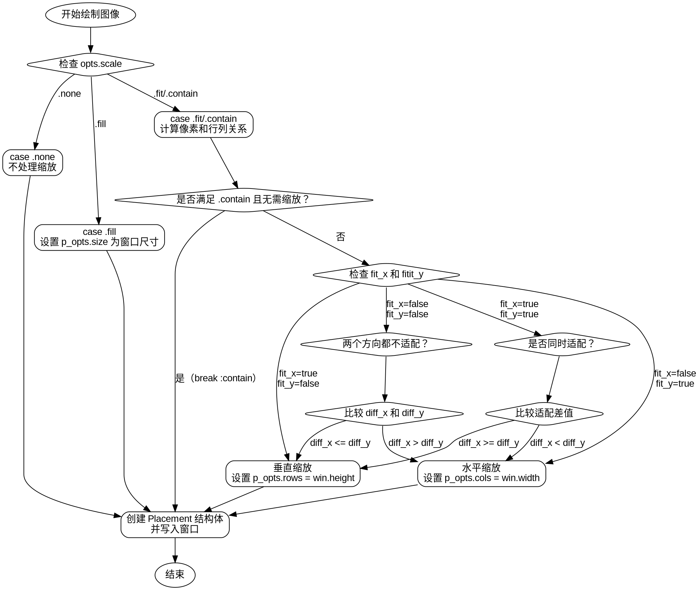

嗯，我需要为这个Zig函数draw画一个流程图。首先，我得仔细理解这个函数的结构和逻辑。函数的主要部分是一个switch语句，处理不同的缩放选项：none、fill、fit、contain。每个case有不同的处理逻辑，特别是fit和contain合并处理，里面有复杂的条件判断。

首先，当scale是none时，直接跳过，不处理。当是fill时，设置size为窗口的宽高。接下来是fit和contain的情况，这部分比较复杂。需要计算像素和行列的关系，判断图像是否适应窗口，然后决定缩放的方式。这里有多个条件分支，比如是否fit_x和fit_y，或者是否需要水平或垂直缩放，还有比较差异来决定缩放方向。

我需要把这些条件分支都理清楚，确保流程图能准确反映每个可能的路径。比如在contain的情况下，如果图像已经适应窗口，就直接跳出。否则，检查各个方向是否需要缩放，再根据差异大小选择缩放方向。fit的情况则是确保图像适应窗口，选择最接近的方向。

然后，流程图的开始是函数入口，接着根据不同的scale选项分叉。每个分支内部的条件判断需要作为菱形决策节点，处理不同的情况。最后，无论哪个分支，都会创建一个Placement结构并写入窗口。

需要注意的是，有些条件判断是嵌套的，比如在fit和contain的处理中，有多个if-else结构。要确保这些嵌套的条件在流程图中正确表示，可能使用子流程或者连接线来避免交叉混乱。另外，函数中的变量计算，如pix_per_col、pix_per_row等，虽然重要，但在流程图中可能不需要详细展示，主要关注控制流。

可能容易出错的地方是处理fit和contain的逻辑，特别是多个条件判断的顺序和关系。需要仔细检查每个条件的分支，确保流程图中的路径与实际代码一致。另外，函数结尾的Placement和writeCell操作是所有路径的共同终点，要确保所有分支都汇聚到这里。

最后，确保流程图符号正确：开始/结束用椭圆，操作用矩形，条件判断用菱形，箭头表示流程方向。不需要使用mermaid语法，而是用graphviz的DOT语言来描述。
================================================

该流程图使用 Graphviz DOT 语言表示，关键逻辑说明如下：

1. **层级结构**：从 switch 语句分支出 .none/.fill/.fit/.contain 三种主路径
2. **复杂判断**：针对 .fit/.contain 的嵌套条件使用多层菱形决策节点：
   - 优先检查 .contain 是否直接满足
   - 通过 fit_x/fit_y 判断适配方向
   - 对双不适配情况比较像素差值
   - 对双适配情况比较适配余量差值
3. **统一出口**：所有分支最终汇聚到 Placement 创建操作
4. **符号规范**：
   - 椭圆表示开始/结束
   - 菱形表示条件判断
   - 方框表示操作步骤
   - 箭头标注条件跳转逻辑

可通过 Graphviz 工具生成 PNG/SVG 等格式的流程图。