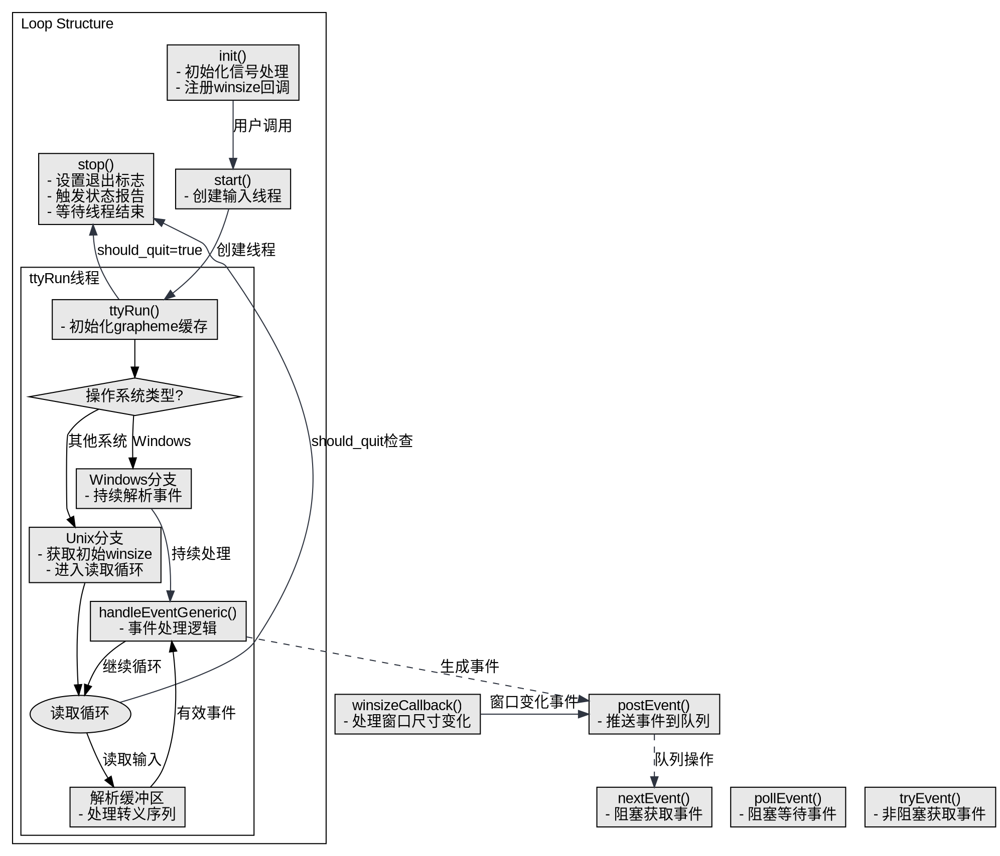

嗯，我需要帮用户把提供的Zig代码中的Loop函数用Graphviz画成流程图。首先，我需要理解这段代码的结构和逻辑。看起来这是一个事件循环的实现，支持多线程处理输入事件。

首先，Loop是一个泛型函数，返回一个结构体。结构体包含了一些成员变量，比如tty、vaxis、队列、线程等。接下来有多个方法，比如init、start、stop、nextEvent等。每个方法有不同的功能，比如初始化、启动线程、停止线程、处理事件等。

我需要确定各个方法之间的关系和执行流程。比如，start方法会创建线程执行ttyRun函数，而ttyRun中会根据操作系统类型有不同的处理逻辑，比如Windows和其他系统。在非Windows系统中，会进入一个读取循环，处理输入事件，解析并生成事件放入队列中。

接下来要考虑如何将这些逻辑转化为流程图。流程图通常包括开始节点、结束节点、判断节点、处理步骤等。需要注意各个方法之间的调用关系，尤其是线程的启动和停止，事件队列的入队和出队操作。

可能的结构是：

1. Loop结构体的初始化（init方法），设置信号处理。
2. 启动线程（start方法），执行ttyRun。
3. ttyRun根据操作系统进入不同的处理分支。
4. 在非Windows系统中，读取输入，解析事件，处理事件，并可能调用handleEventGeneric。
5. 停止线程时（stop方法），设置退出标志，触发读取，等待线程结束。
6. 其他方法如nextEvent、pollEvent等涉及队列操作。

需要注意条件判断，比如操作系统的判断、是否测试环境、是否有线程存在等。此外，事件处理流程中的循环和错误处理也需要体现在流程图中。

可能会遇到的困难是如何正确表达多线程的流程，以及不同操作系统分支的处理。需要确保每个判断节点和分支清晰，流程连贯。同时，需要正确表示各个方法之间的调用关系，比如postEvent将事件推入队列，nextEvent从队列取出事件等。

最后，使用Graphviz的DOT语言来绘制流程图，确保节点和边的正确连接，使用合适的形状（如矩形表示过程，菱形表示判断，椭圆形表示开始/结束等）。
================================================

生成的流程图包含以下特点：
1. 使用子图展示Loop结构体和线程的层次关系
2. 用菱形节点表示操作系统类型判断
3. 用虚线箭头表示跨线程的队列交互
4. 用不同颜色保持视觉层次
5. 包含关键方法调用和线程生命周期管理
6. 展示了Unix系统的完整读取-解析-处理循环流程
7. 标注了窗口尺寸变化的回调链路

可以通过Graphviz工具（如dot命令或在线编辑器）渲染为PNG/SVG格式。注意需要保持原始代码中的跨平台特性（Windows/Unix分支）和线程安全逻辑（队列操作）。