好的，我需要为给定的 Zig 函数生成一个流程图。首先，我要仔细阅读这段代码，理解它的结构和逻辑流程。这个函数名为handleEventGeneric，它处理不同的事件类型，并根据操作系统类型（Windows 和其他）有不同的处理分支。

首先，函数开始于一个switch语句，检查builtin.os.tag是否为.windows。如果是，进入Windows特定的事件处理；否则处理其他操作系统的事件。在Windows分支中，针对不同的事件类型（如winsize、key_press、key_release等），有不同的处理逻辑。对于非Windows系统，事件处理更为复杂，包括更多的case，比如paste事件、颜色报告、各种能力检测等。

接下来，我需要将这段代码的逻辑转化为流程图。流程图应该从函数入口开始，然后根据操作系统分支分为两部分。每个分支内部处理不同的事件类型，每个事件类型内部又有条件判断和处理步骤。需要注意的是，有些事件处理中还有嵌套的条件判断，比如检查Event类型是否包含特定字段，或者某些条件触发状态变更。

在绘制流程图时，需要明确各个判断节点和处理步骤的连接关系。例如，在Windows的key_press事件中，首先检查是否为F3键加Shift，如果是，则设置一些标志并返回；否则继续处理，可能修改key的text字段并转发事件。非Windows分支中的事件处理更多，包括粘贴事件、颜色报告、各种能力检测等，每个事件处理逻辑需要单独的分支。

需要注意的是，某些事件处理会导致直接返回或状态变更，例如当检测到特定能力时，设置vx的caps字段并记录日志。此外，对于粘贴事件，如果有paste_allocator存在，可能需要释放内存。

最后，流程图需要确保所有可能的路径都被覆盖，包括默认情况（else或未明确处理的case），并且正确连接各个节点，避免遗漏或错误的连接。
================================================

```graphviz
digraph flowchart {
    node [shape=rectangle, fontname="Courier", fontsize=10];
    edge [fontname="Courier", fontsize=10];
    
    start [label="handleEventGeneric() 入口"];
    os_check [label="检查操作系统类型 builtin.os.tag"];
    windows_branch [label="Windows 分支"];
    other_os_branch [label="其他操作系统分支"];
    event_switch_win [label="switch(event)"];
    event_switch_other [label="switch(event)"];
    end [label="流程结束"];
    
    start -> os_check;
    os_check -> windows_branch [label=".windows"];
    os_check -> other_os_branch [label="其他"];
    
    // Windows分支
    subgraph cluster_windows {
        label="Windows 事件处理";
        style=filled;
        color=lightgrey;
        
        windows_branch -> event_switch_win;
        
        // Windows事件类型
        event_switch_win -> winsize_win [label=".winsize"];
        winsize_win [label="检查 Event 是否有 winsize 字段\n如果有则转发事件"];
        
        event_switch_win -> key_press_win [label=".key_press"];
        key_press_win [label="检查 F3+Shift 组合键\n如果符合条件设置能力标志\n否则缓存文本并转发事件"];
        
        event_switch_win -> key_release_win [label=".key_release"];
        key_release_win [label="缓存文本并转发事件"];
        
        event_switch_win -> cap_da1_win [label=".cap_da1"];
        cap_da1_win [label="唤醒查询线程\n标记查询完成"];
        
        event_switch_win -> mouse_win [label=".mouse"];
        mouse_win [label="转换鼠标坐标并转发事件"];
        
        event_switch_win -> focus_in_win [label=".focus_in"];
        focus_in_win [label="转发 focus_in 事件"];
        
        event_switch_win -> focus_out_win [label=".focus_out"];
        focus_out_win [label="转发 focus_out 事件"];
    }
    
    // 其他操作系统分支
    subgraph cluster_other_os {
        label="其他操作系统事件处理";
        style=filled;
        color=lightgrey;
        
        other_os_branch -> event_switch_other;
        
        // 其他OS事件类型
        event_switch_other -> key_press_other [label=".key_press"];
        key_press_other [label="同Windows的key_press处理逻辑"];
        
        event_switch_other -> key_release_other [label=".key_release"];
        key_release_other [label="同Windows的key_release处理逻辑"];
        
        event_switch_other -> mouse_other [label=".mouse"];
        mouse_other [label="同Windows的mouse处理逻辑"];
        
        event_switch_other -> paste_events [label="粘贴相关事件"];
        paste_events [label="处理粘贴开始/结束/内容\n根据allocator释放内存"];
        
        event_switch_other -> color_events [label="颜色报告/主题事件"];
        color_events [label="转发颜色报告和主题事件"];
        
        event_switch_other -> capability_events [label="能力检测事件"];
        capability_events [label="设置kitty键盘/图形\nRGB/Unicode等能力标志"];
        
        event_switch_other -> winsize_other [label=".winsize"];
        winsize_other [label="标记带内调整大小\n重置信号处理器并转发事件"];
    }
    
    // 公共连接
    {winsize_win key_press_win key_release_win cap_da1_win mouse_win focus_in_win focus_out_win} -> end;
    {key_press_other key_release_other mouse_other paste_events color_events capability_events winsize_other} -> end;
}
```
