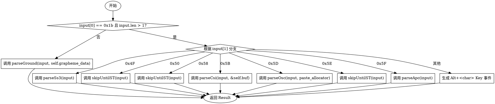

嗯，我需要为给定的Zig函数绘制一个流程图。首先，我应该仔细阅读代码，理解它的逻辑结构。这个函数叫做parse，接受输入和一个分配器，然后返回Result。函数的主要逻辑是处理转义字符序列，比如ANSI转义码。

首先，函数检查输入是否以0x1b（ESC字符）开头，并且长度大于1。如果是的话，根据下一个字符的不同值，调用不同的解析函数。比如，如果是0x5B，就调用parseCsi；如果是0x5D，调用parseOsc，等等。如果下一个字符不在已知的选项中，就构造一个Key事件，表示Alt加该字符的组合键。

如果输入不以ESC开头或者长度不大于1，就调用parseGround函数处理普通输入。

接下来，我需要把这些逻辑转化为流程图的结构。流程图应该从开始节点开始，然后根据条件分支。主要的判断点是输入的第一个字符是否为ESC且长度>1。如果是，进入switch分支；否则，进入parseGround。

在switch分支中，每个case对应不同的处理函数，比如parseSs3、skipUntilST、parseCsi等。最后的default情况处理未知字符，生成Key事件。

需要注意的是，流程图中的每个判断和操作都应该用正确的图形符号表示，比如菱形表示条件判断，矩形表示处理步骤，箭头表示流程方向。

还需要确保各个分支的结束点都正确连接到返回结果，或者继续流程。例如，每个case处理完后直接返回结果，而最后一个else情况也会返回结果。如果输入不满足初始条件，则进入parseGround并返回其结果。

可能容易出错的地方是遗漏某个分支或者条件判断的顺序。需要逐一检查每个case是否正确对应代码中的逻辑，特别是输入长度的判断是否准确。

总结一下，流程图的结构大致如下：

1. 开始
2. 检查input[0] == 0x1b且input.len >1？
   - 是：进入switch(input[1])
     - 各个case对应不同的处理函数，并返回结果
     - 其他情况生成Alt+char的Key事件并返回
   - 否：调用parseGround并返回结果
3. 结束

确保每个处理步骤后的返回都正确连接到结束节点。需要明确每个分支的出口，避免流程中断或不连贯。
================================================
