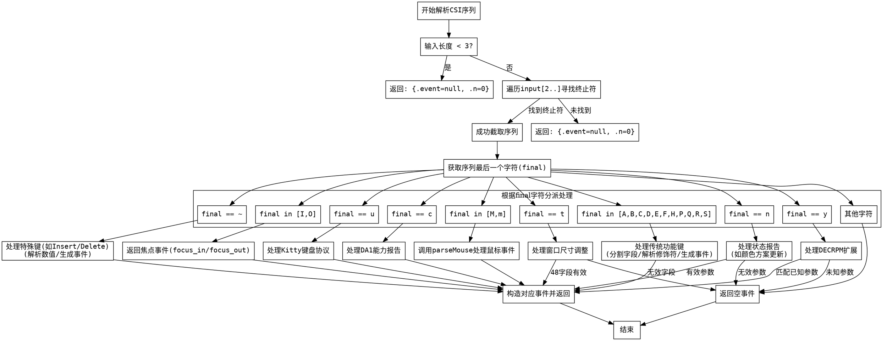

好的，我现在需要为这个用Zig编写的parseCsi函数绘制一个流程图。首先，我需要仔细理解这个函数的结构和逻辑，这样才能准确地转换成流程图。

函数parseCsi接收一个输入字节切片和一个文本缓冲区，返回一个Result结构。看起来它的主要功能是解析CSI（控制序列引入器）转义序列，并根据不同的参数生成相应的事件。

首先，函数开始检查输入的长度是否小于3，如果是的话，直接返回n为0的空事件。这是第一个判断条件，对应流程图中的开始部分的分支。

接下来，函数尝试从输入的第3个字符（因为输入[2..]跳过了前两个字符，可能是ESC和[）开始遍历，寻找结束字符。这里有一个循环结构，遍历每个字符，直到遇到0x40到0xFF之间的字符，此时截取序列。如果循环正常结束（即没有break），则返回空事件。这部分对应流程图中的循环处理部分。

然后，根据序列的最后一个字符（final），进入不同的处理分支。这里有多个case，比如'A'到'S'处理方向键等功能键，'~'处理如插入、删除等键，'I'和'O'处理焦点事件，'M'和'm'处理鼠标事件，其他如'c'、'n'、't'、'u'、'y'等处理不同的设备控制或扩展功能。每个case内部可能有进一步的解析，比如分割参数、解析修饰符、处理文本编码等。

对于每个case，需要绘制对应的处理流程。例如，当final是'A'到'S'时，会解析字段，处理修饰符，生成key_press或key_release事件。同样，'~'的情况需要解析数值，并映射到不同的键值。处理这些分支时，需要注意是否有子流程，比如字段分割、参数解析、错误处理等。

此外，还有一些特殊情况的处理，比如当final是'n'时，涉及到颜色方案更新；'t'处理窗口大小调整；'u'处理Kitty键盘协议等。每个分支都需要在流程图中明确表示。

需要注意错误处理和提前返回的情况。例如，在解析过程中，如果某个参数无法解析，会返回空事件。这些错误处理的分支也需要在流程图中体现。

最后，将所有分支汇总，确保每个可能的路径都被覆盖，并正确连接到相应的处理步骤和结束节点。

在绘制流程图时，需要使用合适的图形符号，如矩形框表示处理步骤，菱形表示判断条件，箭头表示流程方向。需要确保每个判断条件都有明确的是/否分支，并且处理步骤之间的连接正确无误。

可能遇到的挑战是如何将复杂的逻辑分支清晰地呈现，避免流程图过于复杂。可能需要将某些子流程拆分为单独的节点，或者使用子图来组织相关的步骤，以保持可读性。

总结一下，流程图的结构大致如下：

1. 开始
2. 检查输入长度，若不足3则返回空事件
3. 遍历输入寻找结束字符，构建序列
4. 根据final字符进入不同分支
5. 每个分支内部解析参数，处理修饰符，生成事件
6. 错误处理及返回结果
7. 结束

需要确保每个步骤之间的逻辑正确，并且所有可能的路径都被涵盖。
================================================
