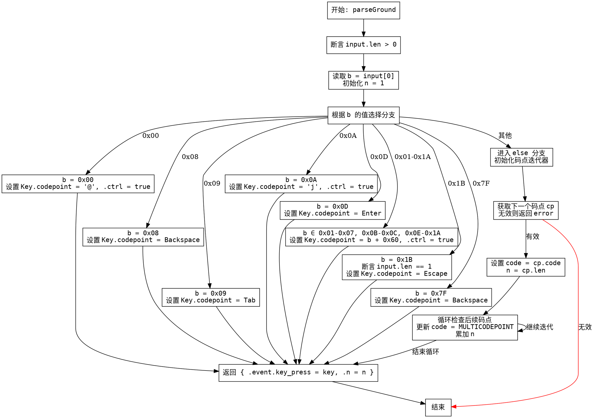

好的，我需要为给定的Zig函数`parseGround`绘制一个流程图。首先，我需要理解这个函数的结构和逻辑流程，这样才能准确地转换为流程图。

首先，函数开始于一个断言，确保输入长度大于0。然后读取输入的第一个字节`b`，并初始化`n`为1。接下来是一个大的switch语句，根据`b`的不同值处理不同的情况，生成对应的`Key`结构。

在switch中，处理了多个特定的控制字符，如0x00、0x08、0x09等，每个对应不同的Key设置。当遇到0x1B（Escape键）时，有一个内部断言，确保输入长度为1，然后生成Escape的Key。

对于其他情况（else块），函数处理可能的UTF-8编码，通过迭代器逐个读取码点，检查是否是多个码点组成的字形（grapheme）。这里涉及到循环，直到确定字形边界为止，然后设置相应的codepoint和文本。

最后，函数返回一个包含`key_press`事件和消耗的字节数`n`的结果结构。

接下来，我需要将这些逻辑步骤转化为流程图。流程图的基本结构应该包括开始、判断、处理步骤和结束。特别需要注意的是switch语句中的各个分支以及else块中的循环处理。

可能的步骤：
1. 开始节点：函数入口，断言输入长度>0。
2. 读取第一个字节`b`，初始化`n=1`。
3. 根据`b`的值进入不同的分支处理。
4. 对于每个case分支，设置对应的Key值。
5. 对于else分支，处理UTF-8码点，可能涉及循环检查字形边界。
6. 最终返回结果。

需要注意流程图的正确分支结构，特别是switch中的多个case和else处理。此外，循环部分需要用循环结构表示，例如判断是否继续迭代码点。

最后，确保不使用mermaid语法，而是用Graphviz的DOT语言来描述流程图。节点和边的定义要清晰，逻辑正确。
================================================
